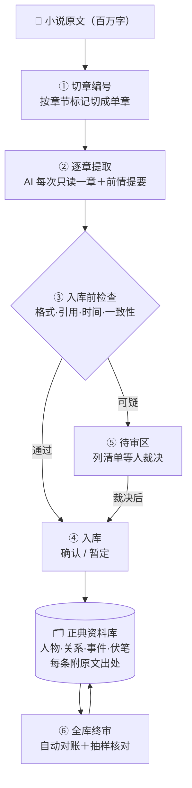

# cbb-pipeline

**让 AI 把百万字长篇小说，梳理成一部「每条都查得到原文出处」的正典资料库。**



## 30 秒：它解决什么问题

AI 读长篇小说，必翻的三个车：

| 翻车 | 后果 |
|---|---|
| 同一人换个名字 → 当成两个人 | 人物档案分裂 |
| 第 50 章埋的伏笔，第 400 章忘了收 | 剧情线断裂没人发现 |
| 前后设定打架（死了又出场） | 矛盾混进资料库 |

根因都一样：**书太长，AI 读完后面忘了前面**。

本工具的办法：**AI 只读一章，"记忆"放在账本里**——
每章单独提取（不用记整本书）→ 结论全部落库并附原文出处 → 拿不准的一律进待审区（宁可多问，绝不混进正式库）→ 最后全库自动对账。

## 你要做的（三步）

```bash
# 1. 装（放进 AI 助手的技能目录，或项目内直接用）
cp -r . ~/.zcode/skills/cbb-pipeline

# 2. 配（填书名 + 正文文件路径）
cp assets/project.template.yaml project.yaml

# 3. 跑（生成书房骨架，然后按 SKILL.md 的流程逐章推进）
py -X utf8 scripts/init_project.py project.yaml
```

## 每步做什么

| 图中步骤 | 实现 | 关键规矩 |
|---|---|---|
| ① 切章编号 | `cbb-coordinate` | 按标记切章，唯一编号，可断点续跑 |
| ② 逐章提取 | `cbb-extract`＋AI 子代理 | 每次只带一章＋前情提要；每条结论必须附"卷/章/行/原文引句" |
| ③ 入库前检查 | `cbb-gate1` | 查格式、查引用能否翻到原文、查时间线、查前后矛盾；不过关不放行 |
| ④ 入库 | `cbb-store` | 三态：确认 / 暂定 / 待人工裁定；矛盾不静默合并 |
| ⑤ 待审区 | `cbb-quarantine` | 可疑信息列成"请你确认"清单，人工裁决后才放行 |
| ⑥ 全库终审 | 终审检查清单 | 死人走路、伏笔超期、悬空引用、抽样对原文 |

## 靠谱吗

- 在一部 **517 章连载小说**上实战运行中
- 全量机械核验：**11.7 万条原文引文，99.8% 可逐字回查**
- 与一套同题材、**经人工多轮复核**的平行资料库交叉对比：**零矛盾**
- 不要求你信它——每条结论都能翻回原文自己验证

## 许可与出处

代码 MIT，文档 CC-BY-4.0。设计参考过 16 个开源项目（只学思路、未复制代码或文本），逐项出处与许可红线见 [ACKNOWLEDGMENTS.md](ACKNOWLEDGMENTS.md)。
