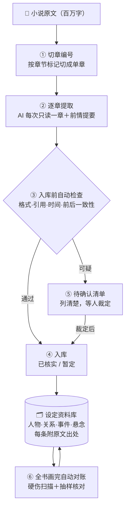

# 长文本资料库构建流水线

**把超长篇文本——小说、文档、维基、法规——自动整理成一部「每条结论都能翻回原文核实」的资料库。**

> **v2.0**：不再只服务小说——小说、文档、维基、法规都行（换一种材料只需改三样配置：怎么切分、有哪些类别、可选词表）；新增三层核查（入库前机器检查＋按批次抽查＋两个人独立复查「还有多少错没被发现」）；小说实例（517 章）已归档为参照样例。



## 它是什么

一部小说动辄几百万字。想让 AI 帮你把设定整理出来，会撞上三个死结：

1. **AI 一次读不完**——读完后面，忘了前面；
2. **同一个人换了称呼**——被当成两个人，档案分裂；
3. **AI 说得头头是道，你却没时间核对真假**——错的东西混进去，越用越乱。

这个工具就是为这三件事造的。整个思路一句话：

> **不让 AI"记住"整本书——让它每次只读一章，把该记的都记到"账本"里。**

## 特点与创新：它和别的做法哪里不一样

> 一句话：**不是让 AI 变强，是把"记"这件事从 AI 的脑子里拿出来，放进一个可检查、可审计的账本。**

### 核心创新一：记忆外包——长度从此不是问题

- **常见做法**：把整本书塞进模型的"记忆"（超长上下文 / 向量检索片段），赌它记得住、不记混。
- **本工具**：**永不要求 AI 同时看到全书**。每章独立处理，跨章记忆全部写进结构化账本。
- **好处**：处理百万字和一万字一样稳——不靠模型的记性，也不怕换更便宜的模型；成本只看章数，不看"上下文撑不撑得住"。

### 核心创新二：可分级信任——"错误进不了正式库"是工程保证，不是口号

- **常见做法**：AI 的输出要么全盘接受（错就一起错），要么人工逐条核（几百章根本核不完）。
- **本工具**：三重设计——
  ① 每条结论**强制附原文出处**（第几章、第几行、原文原句）；
  ② 入库前有自动检查器，**拦截前后矛盾、假引用、时间倒置**；
  ③ 拿不准的一律进"待确认清单"列给你——**宁可多问，绝不硬猜**。
  最终资料库分三档：**已核实 / 暂定 / 待人工确认**，一眼看清可信度。
- **好处**：AI 可靠的部分放心用，可疑的部分不污染库。

### 核心创新三：跨章硬伤自动巡检——把"长篇逻辑"变成可自动查的东西

- **常见做法**："希望它记得前面的设定"。
- **本工具**：把长篇逻辑翻译成确定性规则，全书画完自动扫——**死人又出场、悬念埋了没回收（超期自动报警）、引用的原文翻不到、前后设定打架**——出报告，不用人肉排查。
- **好处**：几百章的硬伤不用等读者来发现。

### 工程上的四个属性

| 属性 | 表现 |
|---|---|
| **成本（token）** | 每章约 3 万–4.5 万 token。**一本 500 万字、517 章的小说 ≈ 1600 万–2400 万 token**（实测外推） |
| **断了随时续** | 半夜中断、断电、重启都不怕：进度在文件里，从断点接着跑 |
| **换书零改造** | 换一本书只改一份配置文件（书名＋正文路径），其余照跑 |
| **双向可验证** | 每条结论能翻回原文自证；还能与既有的、经人工复核的资料库自动交叉对账 |

## 它怎么工作（对照上面那张图）

1. **切章编号**——按章节标记把全书切成单章，给每章一个唯一编号，断点续跑全靠它。
2. **逐章提取**——每章交给 AI 单独处理：产出人物、关系、事件、悬念，每条附"第几章第几行＋原文原句"。
3. **入库前自动检查**——格式对不对、引用的原文能不能翻到、时间线顺不顺、和已经入库的内容有没有打架。不过关的不放行。
4. **入库**——过关的记录进入资料库，分"已核实"和"暂定"两档。
5. **待确认清单**——可疑内容不进库，集中列成清单（按影响大小排序），人工裁定后才放行。
6. **全书画完自动对账**——全书级别扫硬伤＋抽取样本回原文核对，出报告交给你做最终检查。

## 你要做的（三步）

```bash
# 1. 安装：复制本目录到 AI 助手的技能目录即可（项目内直接用也行）
cp -r . ~/.zcode/skills/cbb-pipeline

# 2. 配置：复制下面这份模板，填上书名和正文文件路径
cp assets/project.template.yaml project.yaml

# 3. 开跑：一条命令生成工作目录，然后按 SKILL.md 的说明逐章推进
py -X utf8 scripts/init_project.py project.yaml
```

## 资料库最后长什么样

| 内容 | 说明 |
|---|---|
| 人物 | 一张档案一个人，多种称呼自动归拢，每个称呼标注出自哪章 |
| 关系 | 谁和谁是什么关系，附原文出处 |
| 事件 | 发生了什么、在哪一章，附原文凭据 |
| 悬念/伏笔 | 埋在哪一章、揭了没有；超期没回收会自动报警 |
| 状态 | 每条都有「已核实 / 暂定 / 待人工确认」三挡状态，一眼分清可信度 |

## 靠谱吗

- 实测：一部 **517 章连载小说**正在全流程运行（已完成约四成）；
- 全量机械核验：**11.7 万条原文引用，99.8% 可逐字翻回原文查证**；
- 与另一套**经人工多轮复核**的同类资料库交叉对比：**零矛盾**；
- 不要求你信任工具——每条结论都能自己翻回原文验。

## 许可与出处

代码 MIT，文档 CC-BY-4.0。设计参考过 16 个开源项目（只学思路、未复制代码或文本），逐项出处与许可红线见 [ACKNOWLEDGMENTS.md](ACKNOWLEDGMENTS.md)。
