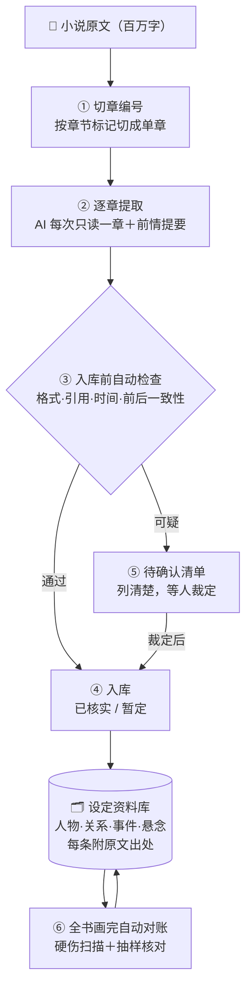

# cbb-pipeline

**把百万字长篇小说，自动整理成一部「每条设定都能翻回原文核实」的设定资料库。**



## 它是什么

一部小说动辄几百万字。想让 AI 帮你把设定整理出来，会撞上三个死结：

1. **AI 一次读不完**——读完后面，忘了前面；
2. **同一个人换了称呼**——被当成两个人，档案分裂；
3. **AI 说得头头是道，你却没时间核对真假**——错的东西混进去，越用越乱。

这个工具就是为这三件事造的。整个思路一句话：

> **不让 AI"记住"整本书——让它每次只读一章，把该记的都记到"账本"里。**

具体做法：

- 把全书切成单章，**AI 每次只读一章**，外加一页自动生成的"前情提要"（这本书里谁是谁、还有哪些悬念没揭）；
- 读完立刻把结论记进资料库，**每条结论都附原文出处**（第几章、第几行、原文原句）；
- 拿不准的、前后打架的内容，**一律不放进正式资料**，而是集中列成"待你确认"的清单；
- 整本书过完，再**自动把全书对一遍账**：谁死了又出现、哪些悬念埋了没揭、哪些记录引用的原文翻不到——一次全列出来。

## 特点（为什么值得用）

- **不挑长度**——百万字照样跑。因为 AI 永远只面对一章加一页提要，从不"一口气读全书"。
- **每条都能自己核实**——资料里每句话都带着原文出处。不要求你信任 AI，翻回原文对质即可。
- **错误进不了正式库**——拿不准、有矛盾的，全部进"待确认清单"，人工点头才算数。宁可多问，绝不硬猜。
- **成本可以压到零**——整条流水线能在免费通道上跑完全书（配合夜间免费额度，实测项目就是这么干的）。
- **断了不用从头来**——半夜中断、断电、电脑重启都不怕：进度写在文件里，下次从断点接着跑。
- **自动盯剧情硬伤**——死人又出场、悬念忘回收、引用对不上原文，自动报警，不用你人肉排查。
- **自动归拢人物称呼**——一个人的多种叫法自动收到同一张人物档案下，并记录每个叫法出自哪一章。
- **全过程可审计**——谁在什么时候记了什么、改了什么，全程留痕可查。
- **不绑定某一本书**——换书只改一份配置文件（书名＋正文路径），其余照跑。
- **成果能直接喂给下游**——整理出的资料可以直接用来做角色卡、世界书、年表，或当作续写时的一致性检查底本。
- **同一个人、两套产出的交叉验证**——支持与既有的、经人工复核过的资料库做自动对比，双方对不上的地方自动列出来。

## 它怎么工作（对照上面那张图）

1. **切章编号**——按章节标记把全书切成单章，给每章一个唯一编号，断点续跑全靠它。
2. **逐章提取**——每章交给 AI 单独处理：产出人物、关系、事件、悬念，每条附"第几章第几行＋原文原句"。
3. **入库前自动检查**——格式对不对、引用的原文能不能翻到、时间线顺不顺、和已经入库的内容有没有打架。不过关的不放行。
4. **入库**——过关的记录进入资料库，分"已核实"和"暂定"两档。
5. **待确认清单**——可疑内容不进库，集中列成清单（按影响大小排序），人工裁定后才放行。
6. **全书画完自动对账**——全书级别扫硬伤＋抽取样本回原文核对，出报告交给你做最终检查。

## 你要做的（三步）

```bash
# 1. 安装：复制本目录到 AI 助手的技能目录即可（项目内直接用也行）
cp -r . ~/.zcode/skills/cbb-pipeline

# 2. 配置：复制下面这份模板，填上书名和正文文件路径
cp assets/project.template.yaml project.yaml

# 3. 开跑：一条命令生成工作目录，然后按 SKILL.md 的说明逐章推进
py -X utf8 scripts/init_project.py project.yaml
```

## 资料库最后长什么样

| 内容 | 说明 |
|---|---|
| 人物 | 一张档案一个人，多种称呼自动归拢，每个称呼标注出自哪章 |
| 关系 | 谁和谁是什么关系，附原文出处 |
| 事件 | 发生了什么、在哪一章，附原文凭据 |
| 悬念/伏笔 | 埋在哪一章、揭了没有；超期没回收会自动报警 |
| 状态 | 每条都有「已核实 / 暂定 / 待人工确认」三挡状态，一眼分清可信度 |

## 靠谱吗

- 实测：一部 **517 章连载小说**正在全流程运行（已完成约四成）；
- 全量机械核验：**11.7 万条原文引用，99.8% 可逐字翻回原文查证**；
- 与另一套**经人工多轮复核**的同类资料库交叉对比：**零矛盾**；
- 不要求你信任工具——每条结论都能自己翻回原文验。

## 许可与出处

代码 MIT，文档 CC-BY-4.0。设计参考过 16 个开源项目（只学思路、未复制代码或文本），逐项出处与许可红线见 [ACKNOWLEDGMENTS.md](ACKNOWLEDGMENTS.md)。
