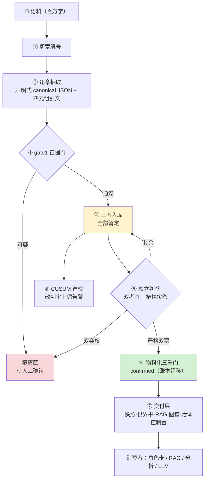

<div align="center">

# CBB 正典库构建流水线

**把超长篇文本整理成一部「每条结论都能翻回原文核实」的资料库——抽取只是候选，独立考官判卷、植株上岗门、双票编制放行；同一部库出四种交付形态与三种知识图谱，486 项测试全绿背书。**

[](#license)
[](#快速开始)
[](#它有什么不一样)
[](#凭什么信它)
[](#凭什么信它)
[](#它有什么不一样)

[它解决什么问题](#它解决什么问题) · [交付物长这样](#交付物长这样) · [它有什么不一样](#它有什么不一样) · [一本书从头到尾](#一本书从头到尾) · [技术内幕](#技术内幕) · [快速开始](#快速开始) · [凭什么信它](#凭什么信它) · [踩过的坑](#踩过的坑) · [常见问题](#常见问题) · [仓库结构](#仓库结构) · [验收状态](#验收状态) · [路线图](#路线图)

</div>

## 它解决什么问题

让 AI 帮你把一部几百万字的小说整理成设定资料库，会先后撞上六堵墙——前三堵在**抽取期**，后三堵在**收束期**（而大多数方案只有前半段，停在一堆没判真伪的候选上）：

**抽取期：**

1. **AI 一次读不完**——读完后面忘了前面；
2. **同一个人换了称呼被当成两个人**——档案分裂；
3. **AI 说得头头是道，你却没时间核对真假**——错的东西混进库，越用越乱。

**收束期：**

4. **候选 ≠ 正典**——抽出来的记录谁判真伪？让抽取者自己判，等于让考生改自己的卷子；
5. **考官也是 AI，考官不可信怎么办**——判卷契约改一个词，同一考官同一批件的支持率能从 27/40 掉到 9/40（实测），没人发现的判卷漂移会静默污染全库；
6. **库建好了给谁用、怎么拿走**——角色卡作者要世界书 JSON，RAG 要分块，分析师要图谱，路人要能离线翻——一种库满足不了四种消费者。

这个项目的对策浓缩成一句话：

> **抽取者永不自判：候选进库全部暂定，独立考官双票编制放行才转「已核实」；考官上岗先过植株考试，契约改动先过刻度校准；交付层把同一部库物化成四种形态——库是活体，快照是自锚定的不可变分发件。**

## 交付物长这样

同一部库（517 章连载小说实测）的收束期产物，全部数字可复算：

| 交付形态 | 给谁用 | 实测规模 |
|---|---|---|
| **正典库本体**（活体） | 流水线自身与控制台 | 6,278 条记录 / 账本 5,268 行哈希链 / 29 条已核实（双票放行） |
| **快照**（离线自锚定） | 离线分发、归档、交接 | 6,278 记录页 + 1,373 隔离页 + 索引，SNAPSHOT.json 锚定账本链头 |
| **SillyTavern 世界书** | 角色卡/世界书作者 | 4,740 条目（键=正名+别名，L3 四分类去重） |
| **RAG 分块** | 检索增强 | 按记录切分，带三态标注与原文出处 |
| **知识图谱三格式** | LightRAG / Gephi / SQL | 4,559 实体 + 1,719 关系 / GraphML 3,081 节点 1,689 边 / 6,278 行三元组 CSV |
| **LLM wiki**（活体服务） | 任何 LLM 与人，HTTP 即取 | `canon_server.py` 每次请求现读库，零导出零过期 |
| **静态站 + egocentric 图谱** | 浏览器直开 | file:// 兼容，搜索/三态着色/逐字引文 |

## 它有什么不一样

- **记忆外包，长度不是问题。** 永不要求 AI 同时看到全书：每章独立处理，跨章记忆全进结构化账本。处理百万字和一万字一样稳——成本只看章数，不看"上下文撑不撑得住"，也不怕换更便宜的模型。
- **错误进不了正式库是工程保证。** 每条结论强制附「卷·章·行 + 原文原句」四元组；入库前机器门拦截假引用/时间倒置/前后矛盾；拿不准的一律进隔离区列给人。库内三态：**已核实 / 暂定 / 待人工确认**，一眼分清。
- **抽取者永不自判。** 候选全部暂定入库；「已核实」只能由**独立考官编制**放行——双外部考官严格双票（都 support 且零 against），第三票出主线只作审计。考官输入面有白名单审计：图派生键混进判定面即中止。
- **考官上岗要考试。** 已知答案的植株（正植株须 support、负植株不许 support）随机掺入判卷卷面，捕获 <5/6 = 考官不合格，全卷结果降级「仅参考」——这套门对契约变更同样适用：v2.2 契约 50 件验证轮植株捕获 8/8，才允许物料化放行。
- **契约措辞是仪器参数，不是文风。** 同一批 40 件、同一考官，仅判卷契约从 v1 换到 v2，支持率 27→9（24 件翻成弃权）——所以契约变更走「同批 A/B → 植物考试 → 50 件验证轮封顶」的刻度校准法（PT-026），契约文本进版本管理（`contracts/judge-v2.2.txt`）。
- **放行即落账，账本不可改。** 物料化过三重门（轮次门 PASS / 暂定态 / 证据门零违规）后以 `by="promotion"` 写入 append-only 账本与状态迁移侧车——原文件不改写，历史可重放。
- **库是活体，快照是遗照。** 日常查询走动态控制台（每次请求现读库）；分发走自锚定快照（页数=记录数、账本链头锚在 SNAPSHOT.json，任何机器可验）。反馈永远经流水线回写，不直接改快照。
- **LLM 零可执行代码。** 抽取产物是声明式 canonical JSON（schema 定类型），越界格式被门 1 拒收——不存在"AI 写的脚本在库里跑"这回事。
- **断了随时续。** 进度全在文件里：半夜中断、断电、重启，从断点接着跑，已收口批次scoped commit 可单独回退。

**工程实测属性：**

| 属性 | 表现 |
|---|---|
| **成本（token）** | 每章约 3 万–4.5 万 token；500 万字、517 章 ≈ **1600 万–2400 万 token**（实测外推） |
| **换书零改造** | 只换三样配置：单元切分规则、类型体系（须彩排标定）、可选词表 |
| **双向可验证** | 每条结论翻回原文自证；还能与经人工复核的既有库自动交叉对账 |

> **为什么知识图谱不当仓库？** 库本体永远是纯文本文件（可逐字核对、可 diff、可断点续跑）；图是照着文件另画的参考层，干跨章关系巡检与抽取前"人物小抄"。两头规矩：**入库不依赖它**（它坏了先记账照常干活），**终审必须依赖它**（导出债务清零才许做终审）。Neo4j 只在这一处可选需要，不装不影响主链与交付。

## 一本书从头到尾

**抽取期**（详见 [SKILL.md](SKILL.md) 步骤⓪-⑦ 与[全流程说明书](全流程说明书.md)）：

1. **开书**——`init_project.py` 一条命令生成 8 目录 + 4 文件（判卷/抽取配置模板、契约目录、开书清单），已有目录拒绝覆盖。
2. **切章编号 → 彩排三章 → 类型标定**——按章节标记切单章；三章彩排校准本体类型（R-030：类型体系禁止跨书盲抄）。
3. **主队列抽取**——每章派工上下文包，AI 产出人物/关系/事件/悬念/设定，每条附「章·行 + 原文原句」；gate1 证据门拦截假引用。
4. **三态写入**——过关进库（暂定），可疑进隔离区（待人工确认），全程 append-only 账本；每批收口跑机械自检十项。

**收束期**（`scripts/cbb2/` 核心 + `scripts/pipeline/` 运行件）：

5. **考官上岗**——`judge_exam.py` 植株上岗考试，捕获 ≥5/6 才有判卷资格。
6. **判卷**——`judge_assemble.py` 组卷（真卷+植株随机掺混，特权字段物理分离）→ 双考官背靠背出票 `judge_ds.py` → `judge_join.py` 严格双票合卷（support∧零against=晋升，双弃权=人审，其余=hold）。
7. **物料化**——`run_materialize.py` 三重门放行，confirmed 以账本迁移写入；引擎内部再验一遍选票，防呆门不信调用方自滤。
8. **增量回流**——语料更新后 `ingest_watch.py` 探测变更章节，三态增量（新增/变更/不变），变更章走人工窗不自动重抽。
9. **交付物化**——`wiki_export.py` 自锚定快照 → `batch6_export.py` 世界书+RAG 分块+聚合页 → `kg_export.py` 三格式图谱 → `canon_server.py` 活体控制台（浏览器开 :8420）。
10. **常态巡检**——`g17_circle.py` 巡检圈：队列→执行→CUSUM 喂入；改判率上偏越限即告警停线。

## 技术内幕


```mermaid
flowchart TB
    A["📖 语料（百万字）"] --> B["① 切章编号"]
    B --> C["② 逐章抽取<br/>声明式 canonical JSON + 四元组引文"]
    C --> D{"③ gate1 证据门"}
    D -->|"通过"| E["④ 三态入库<br/>全部暂定"]
    D -->|"可疑"| F["隔离区<br/>待人工确认"]
    E --> G{"⑤ 独立判卷<br/>双考官 + 植株掺卷"}
    G -->|"严格双票"| H["⑥ 物料化三重门<br/>confirmed（账本迁移）"]
    G -->|"双弃权"| F
    G -->|"其余"| E
    H --> I["⑦ 交付层<br/>快照·世界书·RAG·图谱·活体控制台"]
    E --> J["⑧ CUSUM 巡检<br/>改判率上偏告警"]
    I --> K["消费者：角色卡 / RAG / 分析 / LLM"]

    style E fill:#fff3cd
    style H fill:#d3f0d3
    style F fill:#f8d7da
```

给想看机制的人，每条在仓内都有对应实现与测试：

1. **append-only 账本 + 哈希链**（`cbb2/ledger.py`）——每行带前行哈希，快照锚定链头，任何删改可验。genesis 单源（`EMPTY_SHA`）；"双 genesis"是真实踩过并修掉的坑。
2. **证据四元组与五层证据门**（`cbb/cbb-gate1/`）——格式→逐字回落→时间线→跨章一致性→样本回核，层层有正负对照测试。
3. **判卷编制与植株门**（`cbb2/judging.py` + `pipeline/judge_exam.py`）——编制=配置（`judging.config.json`），考官 key 走 env→registry 顺序读回、零硬编码；植株构造支持三种记录形态；特权字段（expected/is_plant）物理分离，防"考官看见答案"。
4. **契约刻度校准法 PT-026**（`contracts/`）——契约是行为仪器：措辞变动必须同批 A/B + 植物考试 + 50 件验证轮三步定档，禁止直接全量换约。
5. **物料化三重门**（`cbb2/materialize.py`）——轮次门（植株捕获 PASS）∧ 暂定态 ∧ gate1 零违规；引擎内部复验选票，不信任调用方过滤。
6. **CUSUM 改判率监测**（`cbb2/cusum.py`）——上偏累计 S_t = max(0, S_{t-1} + (p_t−p0) − k)，S≥h 告警；p0/k/h 预注册，首圈打基线。
7. **快照自锚定**（`cbb2/export.py`）——SNAPSHOT.json 记 录数=页数 对账 + 账本链头 + 隔离页清单；引文逐字抽样核验；快照只读，回流走流水线。
8. **L3 实体名四分类**（`cbb2/aggregate.py`）——正名可并 / 别名需同指证据 ≥0.85 / 称号描述语永不并 / 存疑即拆；并簇决策全部留痕。

## 快速开始

```bash
git clone https://github.com/master666-max/cbb-pipeline.git
cd cbb-pipeline

# 0. 自检（探外部环境与图库归属；主链零外部服务，增值件 BLOCKED 不阻断开书）
py -X utf8 scripts/cbb/tools/环境自检.py --project-token <本书命名空间> --json

# 1. 安装为技能（或就在本目录用；Qoder 侧按插件位装）
cp -r . ~/.zcode/skills/cbb-pipeline

# 2. 开新书：一条命令出脚手架
py -X utf8 scripts/init_project.py --book 书名 --into D:/书库目录

# 3. 抽取期：按 SKILL.md ⓪-⑦ 推进（切章 → 彩排标定 → 主队列 → 收口自检）

# 4. 收束期：判卷到交付
py -X utf8 scripts/pipeline/judge_exam.py       --config judging.config.json   # 考官上岗考试
py -X utf8 scripts/pipeline/judge_assemble.py   --config judging.config.json   # 组卷（含植株）
py -X utf8 scripts/pipeline/judge_ds.py         --config judging.config.json   # 外部考官腿
py -X utf8 scripts/pipeline/judge_join.py       --config judging.config.json   # 严格双票合卷
py -X utf8 scripts/pipeline/run_materialize.py  --config judging.config.json   # 三重门放行
py -X utf8 scripts/pipeline/wiki_export.py      --store 本体库 --out 快照       # 自锚定快照
py -X utf8 scripts/pipeline/batch6_export.py                                   # 世界书+RAG 分块+聚合页
py -X utf8 scripts/pipeline/kg_export.py                                       # LightRAG/GraphML/三元组
py -X utf8 scripts/pipeline/canon_server.py --store 本体库 --port 8420         # 活体控制台

# 全套测试（纯标准库，无需装任何东西）
py -X utf8 -m pytest scripts/cbb scripts/cbb2-tests -q     # 486 passed, 5 skipped
```

**环境要求**：Python 3.10+（主链与测试纯标准库）。抽取期要接一个 LLM（换书只换三样配置）；判卷考官要两个外部对话端点（key 走环境变量/注册表读回，**不写入任何文件**）；Neo4j 仅图派生层增值件需要。

## 凭什么信它

- **486 项测试全绿**（5 项环境性跳过，跳过原因写在测试里）——纯标准库任何机器可重跑；合卷/物料化/快照导出测试全部真实建库、真实落盘、真实断言，不在 mock 里自我安慰。
- **实例数字可复算**：517 章连载小说全流程运行，**117,000+ 条原文引用 99.8% 逐字可翻回原文**；与另一套经人工多轮复核的同类资料库交叉对比**零矛盾**。
- **判卷线有对照实验背书**：契约 v2 弃权坍缩用同批 A/B 定位（40 件：27→9，24 件翻转，植株层 4/8→0/8，对照组 12/12→10/12）；v2.2 验证轮 48 正件 + 8 植株，捕获 8/8，晋升率 0.69 [Wilson 95%: 0.55, 0.80]——宣称带区间，不带裸点。
- **诚实失败有档案**：某轮考官植株捕获 6/8 未过门 → 全卷结果主动降级「仅参考」而非硬发；跨实现试点（另一套工具建的库）直读本流水线，植株 8/8 PASS 才收货。
- **物料化有账可查**：29 条 confirmed 每条对应一条 `by="promotion"` 账本迁移，可重放、可回溯到具体轮次与票面。

## 踩过的坑

以下全部真实发生并已写进测试或配置注释（欢迎少踩一遍）：

- **判卷契约措辞=支持率刻度。** "从严倾向"四个字 + 四个弃权示例，把同一考官同一批件的支持率从 27/40 压到 9/40。契约不是文风问题，是仪器参数——换约必须走刻度校准（PT-026）。
- **特权字段泄漏进判定面。** 植株的 expected/is_plant 字段出现在考官卷面里，考官"看见答案"导致植物盲——修法是特权清单物理分离（`manifest_priv.jsonl`）+ 随机掺卷。
- **argv 缓存复放陷阱。** 编排缓存按 argv 键控：改了脚本内容但 argv 没变，重跑拿到旧结果——改脚本必须同时改 argv（加轮次标签）。
- **work_dir 误指历史目录。** 判卷配置的 work_dir 曾误指试车目录，一次轮次覆写 59 个文件（git 恢复）。开轮前先查 work_dir 指向，已写进配置注释。
- **嵌套仓 gitlink 不能 cat-file。** 仓中仓的树条目是 160000 commit 对象，其 HEAD 不在父仓对象库，`cat-file blob` 必炸——树分派要用 `ls-tree`。
- **生成器条件链语法。** `sum(1 for x if A if B else C)` 是 SyntaxError，且同一天栽三次——复杂过滤抽成具名函数。
- **双 genesis。** 账本创世行一份写 `"genesis"` 字符串、一份写 64 个 0，对账必炸——单源化到 `ledger.EMPTY_SHA`。

## 常见问题

**抽取和判卷为什么必须分开？** 抽取者判自己的卷子=考生改卷。独立考官编制 + 植株掺卷让"判卷质量"本身可测量：捕获率不过门，整卷结果自动降级，污染进不了正式库。

**换一本书要改什么？** 三样：单元切分规则、本体类型体系（必须经三章彩排重新标定，禁止盲抄他书——R-030）、可选词表。正文流程、契约、门、账本全部不变；`init_project.py` 生成的模板里写死了这条纪律。

**必须联网吗？** 抽取要接 LLM、判卷要接两个外部考官端点；测试、快照导出、图谱导出、静态站、动态控制台全部离线可跑。

**快照和控制台什么关系？** 库是活体（控制台每次请求现读，永不过期）；快照是某时刻的自锚定分发件（离线、只读、可验真）。要新鲜找控制台，要分发/归档/交接用快照——反馈一律经流水线回写活体，不改快照。

**数字怎么复核？** 测试一条命令全量重跑；实例数字（6,278 记录 / 4,740 词条 / 4,559 实体）来自 SNAPSHOT.json 与导出对账文件，账本链头哈希在案，任何机器可验。

## 仓库结构

| 路径 | 内容 |
|---|---|
| [`SKILL.md`](SKILL.md) / [全流程说明书.md](全流程说明书.md) | 技能入口（步骤⓪-⑦+验收判据）/ 每环节做什么·为什么·失效会怎样 |
| [`scripts/cbb/`](scripts/cbb/) | 抽取期六模块（coordinate/anchor/extract/gate1/quarantine/store）+ 四契约 + tools（词表/巡检/对账/环境自检…） |
| [`scripts/cbb2/`](scripts/cbb2/) | 收束期核心：ledger 账本 / notary 存证 / store 三态 / **judging 判卷 / extraction 增量 / aggregate 聚合 / materialize 放行 / export 快照 / cusum 巡检** + NLI / 治理 / 体检 |
| [`scripts/pipeline/`](scripts/pipeline/) | 收束期运行件：judge_*（考试/组卷/考官腿/合卷/修复）、run_materialize、wiki_export、batch6_export、kg_export、canon_server、ingest_watch、g17_circle |
| [`scripts/cbb/contracts/judge-v2.2.txt`](scripts/cbb/contracts/judge-v2.2.txt) | 现行判卷契约（PT-026：可校准仪器参数，变更走刻度法） |
| [`scripts/cbb2-tests/`](scripts/cbb2-tests/) | 收束期测试套件 |
| [`references/`](references/) | 抽取规范 / 审查收口 / 图谱派生层 / 检索增强 / 编排并发 / 判例模板 |
| [`assets/`](assets/) | project.template.yaml 开书配置模板 |

## 验收状态

抽取期主线（⓪-⑦）+ 收束期主线（判卷/物料化/交付/巡检）全绿。回归基线：**486 passed + 5 skipped**。

<details>
<summary><b>套件亮点（点击展开）</b></summary>

| 套件 | 覆盖 |
|---|---|
| `test_judging_line` / `test_judging_config` | 判卷编制装配 / 合卷三态 / 植株构造三形态 / key 读回链 |
| `test_materialize` | 三重门正反例 / 防呆门不信调用方 / 账本迁移写入 |
| `test_export` / `test_wiki_export` | 快照自锚定 / 页数对账 / 不覆盖既有快照 / 账本链头 |
| `test_aggregate` | 并簇 union-find / L3 四分类 / 别名前缀比对（含 prefix 陷阱回归） |
| `test_cusum` | 稳态零警 / 持续漂移触发 / 方向性（上偏） |
| `test_extraction_config` / `test_ingest_diff` | 边界构造 / 三态增量检测 / 尾随空白归一 |
| `test_v3_store` / `test_v3_notary` / `test_v3_phased` | 三态写入 / 存证 / 断点续跑 |
| `test_矛盾分流` / `test_连续性巡检` / `test_派生层对账` | 硬伤四分类 / 跨章巡检 / 图账对账 |

</details>

## 路线图

- [x] 抽取期六模块 + 五层证据门 + 三态写入（517 章实例验证）
- [x] v3 包化重建：ledger / notary / store / promote / NLI / 治理（数据布局与 v1 逐字节兼容）
- [x] 收束期产品化批次 1-7：判卷配置层 / 增量摄入 / 快照交付 / 物料化 / 聚合+CUSUM 巡检 / 世界书+RAG 导出 / 动态控制台
- [x] 契约刻度校准法落地（PT-026）：v1→v2.2 同批 A/B 定位 + 50 件验证轮 + 契约文本进版本管理
- [x] 知识图谱三格式导出（LightRAG / GraphML / 三元组）+ 出品规格 v1.0（AI 可读消费指引）
- [ ] 聚合页 L4 同指判定（歧义对精并，LLM 辅助）
- [ ] SillyTavern 世界书实机导入测试（需 ST 环境）
- [ ] 人工窗载体选型落地（Label Studio/LabelU，判例 80-150 件解锁校准三件套）
- [ ] watchdog 常驻形态（计划任务轮询版已可用：`ingest_watch.py --once`）

## 致谢

- 设计参考过 **16 个开源项目**（只学思路、未复制代码或文本），逐项出处与许可红线见 [ACKNOWLEDGMENTS.md](ACKNOWLEDGMENTS.md)；图派生层思想底座另参照 [LightRAG](https://github.com/HKUDS/LightRAG)（HKUDS）与 GraphRAG / Graphiti 预调研坐标系。
- 门面所引全部实测数字出自 517 章连载小说的全流程运行（已归档为参照样例，词表与判例不迁移）。

## License

<div align="center">

代码 [MIT](LICENSE) · 文档 [CC-BY-4.0](LICENSE) · © 2026

</div>
