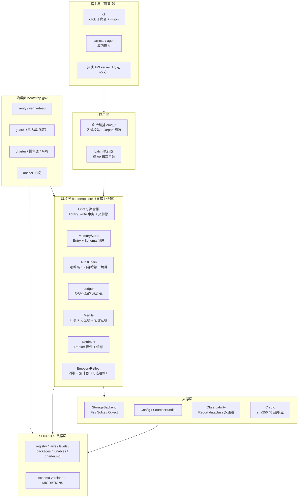
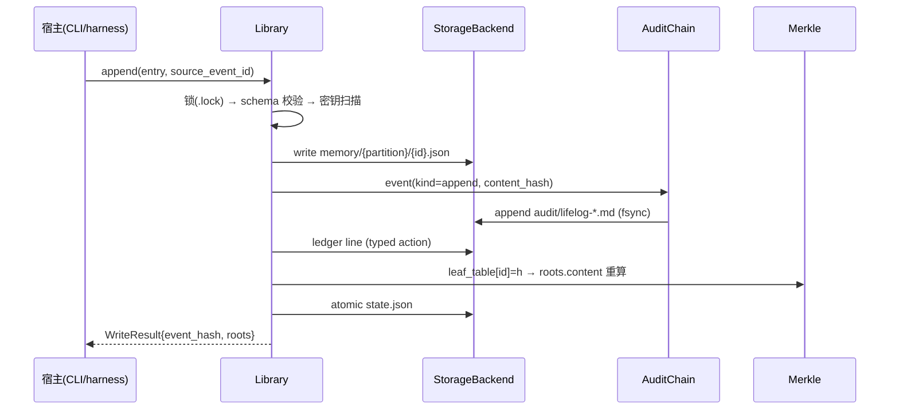

bootstrap_v3 架构演进工单
===================

**WO-2026-B3ARC · 架构专项（与 WO-2026-B3V39/Q 系修复工单配套）**

0. 工单元信息

--------

| 项    | 值                                                                                          |
| ---- | ------------------------------------------------------------------------------------------ |
| 工单编号 | WO-2026-B3ARC（票号前缀 `ARC-`，与 Q 系无冲突）                                                        |
| 前置基线 | Q 系工单 M1 全部落地（尤其 **Q-001 统一写路径**、**Q-017 fixture**、**Q-002 invariant 助手**）                 |
| 吸收声明 | 本工单**吸收并升级** Q-022「架构登记簿」——原 A1–A7 由登记态转为实施态                                               |
| 波次切分 | Wave 1 → **v3.10**（非破坏性奠基）· Wave 2 → **v4.0**（破坏性，带迁移）                                     |
| 治理   | 全部票属慢车道（铁律 6）：人类令牌按 ARC-008 升级后的机制执行；每票落地后 `guard --snapshot` → 抄录人侧 → `guard --anchor` 过账 |

1. 架构再审视（Q 系未覆盖的五个系统性观察）

------------------------

> 前一份审查聚焦"执行层缺陷"；本节是再往下一层的结构判断，是本工单全部立项的依据。

**O-1 · 三平面混装**。单文件内共存三个本应分离的关注平面：**引擎**（library 运行时：append/retrieve/doctor）、**分发器**（install/absorb/deliver/渲染）、**治理**（charter/verify/guard/锚定）。三者共享全局态（`DATA_DIR`、`TUNABLES`、`TESTS`），导致任何一个平面的改动都在碰同一个全局命名空间——这是 P0-1 类缺陷反复出现的结构性土壤。

**O-2 · 派生物无统一契约**。渲染件（AGENTS/spec/citations）、评测基线、锚定快照、verify 报告都是**可重建的派生物**，但各自的失效检测、重建命令、是否入根散落在五处逻辑里（Y-009 只覆盖渲染件）。缺一张"派生物登记表"来统一声明：触发物、重建命令、是否入根。

**O-3 · 锚语义含混**。公理 E 说"Merkle 根抄录人侧保管"，但当前根口径包含**每次 eval/guard/shadow 都会变的派生物**——根以天为单位抖动，人侧锚点很快失义：用户无法回答"我抄的这个根证明了什么"。锚需要语义收窄。

**O-4 · 人类令牌空转**。`--yes` 是一个 **agent 自己就能加的 CLI flag**。威胁模型明示"防①②不防③"，但公理 F 的字面承诺（“需人类令牌”）在机制上是零强度的：恶意或有缺陷的 agent 全程无需人类介入即可通过 L8/L9 gate。这是声明与机制落差中**安全代价最高**的一处。

**O-5 · 全局可变态阻断测试与嵌入**。`DATA_DIR`/`TUNABLES` 是模块级全局，靠 `set_data_dir` 就地改写。它逼出了 Q-017/Q-018 两张测试卫生票，也使本文件无法被 harness 作为库嵌入（只能 subprocess）。配置应当是**显式传递的对象**，不是全局变量。

2. 架构决策记录（D-1 ~ D-5，含"明确不做"）

----------------------------

> 以下决策本工单内**裁决完毕**，落地时按 x-code 包 ADR 账本惯例写入 `docs/adr/`，哈希入锚定。

| 编号      | 决策                                                                      | 理由                                                                                                                                      |
| ------- | ----------------------------------------------------------------------- | --------------------------------------------------------------------------------------------------------------------------------------- |
| **D-1** | **不做**"从审计链重建条目"（event-sourcing 式重放）                                    | 双平面语义下审计面是"**发生了什么**"的证明面，不是内容存储。重建要求把条目全文塞进事件，审计链膨胀为第二存储，破坏轻量性。替代方案：ARC-002 让每个 append 事件携带**内容哈希**——完整性可证（verify-deep），重建性明确放弃并写入 ADR |
| **D-2** | **不把**向量检索入核                                                            | 核保持最小。m-vector 通过 ARC-009 的 Ranker 插件接口接入，与核解耦                                                                                          |
| **D-3** | **不做** daemon 常驻进程                                                      | `engine batch`（ARC-005）覆盖 80% 摊销场景；daemon 引入生命周期/崩溃恢复复杂度，收益比不成立。登记触发器：单库日 op >10⁴ 再议                                                    |
| **D-4** | 派生物**继续入根**（3.10 维持现状），4.0 经 D-5 收窄                                     | 渐进演进：先建契约（ARC-004），再动口径（ARC-014），避免一步跳两个不变量                                                                                             |
| **D-5** | **v4.0 根口径收窄至内容面**：`memory/ + audit/ + ledger/ + 交付内容体`；渲染件与运行派生物**出根** | 渲染件是 SOURCES×档位的确定性函数，完整性由"重渲染比对"（Y-009 已实现）保证，入根只是重复记账；派生物抖动污染锚语义（O-3）。收窄后：**根的变化 = 内容真的变了**，人侧锚点获得清晰语义                                |

3. 票务总表

-------

### Wave 1 · v3.10（非破坏性奠基，约 8 人日）

| ID      | 标题                        | 服务对象        | 估时    | 依赖        |
| ------- | ------------------------- | ----------- | ----- | --------- |
| ARC-001 | 组合根 `LibraryCtx`（配置对象化）   | O-1/O-5·公理A | 1d    | Q-017     |
| ARC-002 | 审计事件携带内容哈希                | O-2·公理D     | 0.5d  | 无         |
| ARC-003 | `verify-deep`：条目↔链内容级对账   | 公理D         | 0.5d  | ARC-002   |
| ARC-004 | 派生物登记表 `DERIVED`          | O-2·公理B     | 0.5d  | ARC-001   |
| ARC-005 | 检索管线缓存 + `engine batch`   | 性能/D-3      | 0.75d | ARC-001   |
| ARC-006 | 机器可读输出 `--json`           | 观测          | 0.5d  | 无         |
| ARC-007 | 库级互斥锁（写路径内嵌）              | A2 升级       | 0.5d  | **Q-001** |
| ARC-008 | 人类令牌挑战-响应机制（flag 形态）      | O-4·公理F     | 0.75d | 无         |
| ARC-009 | Ranker 插件接口               | D-2·演化      | 0.5d  | Q-008     |
| ARC-010 | golden 评测集闭环（生成→版本化→门禁）   | 公理G         | 0.75d | ARC-006   |
| ARC-011 | 内部 API 契约化（semver + 弃用策略） | O-1         | 0.5d  | ARC-001   |
| ARC-012 | schema 版本注册表（脚手架）         | 演化          | 0.75d | ARC-001   |

### Wave 2 · v4.0（破坏性，带迁移，约 8.5 人日）

| ID      | 标题                | 服务对象      | 估时   | 依赖          |
| ------- | ----------------- | --------- | ---- | ----------- |
| ARC-013 | SOURCES 外置 + 分区锚定 | O-1·公理A/E | 2.5d | ARC-001/004 |
| ARC-014 | 根口径收窄至内容面（D-5 落地） | O-3·公理E   | 1d   | ARC-004     |
| ARC-015 | Merkle 叶表化 + 包含证明 | 公理E·伸缩    | 2d   | ARC-014     |
| ARC-016 | 人类令牌强制化（L8/L9 硬门） | O-4·公理F   | 0.5d | ARC-008     |
| ARC-017 | 存储后端抽象激活 + 迁移链启用  | 演化        | 2.5d | ARC-012     |

4. 执行序与跨单依赖

-----------

    Q系M1 (Q-001/002/017) ──┬→ ARC-001 ─┬→ ARC-004 ─┬→ ARC-013 (4.0)
                            │           │           ├→ ARC-014 → ARC-015 (4.0)
                            │           ├→ ARC-005、ARC-011、ARC-012
                            └→ ARC-007
    ARC-002 → ARC-003
    ARC-006 → ARC-010；ARC-009 → (4.0) m-vector 接入
    ARC-008 → ARC-016 (4.0 强制化)
    Wave1 切版 v3.10 → 存量库迁移（§6.1）→ Wave2 → v4.0 切版 + 存量迁移（§6.2）

5. 详细票面

-------

### ARC-001 · 组合根 `LibraryCtx`【Wave1｜1d】

**动机**：O-1/O-5。消灭 `DATA_DIR`/`TUNABLES` 全局改写，使测试无需 chdir/monkeypatch、harness 可库内嵌入。

**改法**：
    @dataclass(frozen=True)
    class LibraryCtx:
        root: Path                  # 库根
        pkg_data: Path              # 包数据目录（bodies/evals/overrides）
        tunables: Mapping           # 构建时快照，只读
        @property
        def state_path(self) -> Path: return self.root / "state.json"
        def tunable(self, key: str):
            return self.tunables[key]["value"]

    def make_ctx(root: Path, pkg_data: Path = None) -> LibraryCtx: ...

* 全部 `cmd_*(ctx, ...)` 改签；CLI 层一次性构造 ctx；`set_data_dir` 保留为 **deprecated 兼容壳**（内部转 make_ctx），一个次版本后移除。
* `library_write`/`chain_append`/`merkle_root` 增加 ctx 或 root 参数重载，内部函数禁读全局。
* **测试面收益**：Q-017 的 `_data_dir` contextmanager 退役，改为直接 `make_ctx(tmp/"lib", tmp/"pkgdata")`——环境污染类 bug 整类消灭。

**验收**：全测试改 ctx 构造后，在设了 `BS3_DATA_DIR` 的环境跑 run-tests 全绿且环境零污染；grep 确认非兼容壳代码路径无 `DATA_DIR` 全局读。

### ARC-002 · 审计事件携带内容哈希【Wave1｜0.5d】

**动机**：公理 D 说"记忆条目=投影"，但投影与真相源之间**没有内容级关联**——审计只能证明"曾写入 X"，不能证明"现在的 X 就是当时写入的 X"。

**改法**：append 事件行追加内容哈希段（前 16 hex 足够定位篡改，节省审计面体积）：
    h_content = hashlib.sha256(json.dumps(e, ensure_ascii=False, sort_keys=True).encode()).hexdigest()[:16]
    tx.audit(f"entry:{e['id']} → {dest.name} c:{h_content}")

retire 事件同样带被移条目的 `c:`；**历史事件无 `c:` 段属合法**（doctor 按"v3.10 前事件"标注，不算断链）。

**验收**：新 append 的事件行含 `c:`；对条目文件篡改后 ARC-003 能定位；旧库事件行不被误判。

### ARC-003 · `verify-deep`：内容级对账【Wave1｜0.5d】

**动机**：ARC-002 的消费端。当前 doctor 只对账"条目存在性"三方，公理 D 缺内容闭环。

**改法**：`engine doctor --deep`：
    逐条目：从 audit 反查该 id 最近一次 append/retire 事件的 c: 段
      ├─ 无事件 → [无锚条目]（genesis 迁移条目白名单豁免）
      ├─ 现文件哈希 ≠ c: → [内容漂移] 条目被改且无新事件——篡改或绕道写
      └─ 一致 → 通过
    汇总：deep N/M 通过，漂移清单；差异只报告不自动修（铁律1）

**验收**：篡改条目 content 后 deep 报漂移并定位 id；正常生命周期（含 retire）deep 全过；`t_doctor*` 系列不回归。

### ARC-004 · 派生物登记表 `DERIVED`【Wave1｜0.5d】

**动机**：O-2。把散落五处的"派生物失效检测"收敛为一张声明表，同时为 ARC-014 的口径收窄提供数据基础。

**改法**：
    DERIVED = {  # rel → 声明；rooted=是否入 Merkle 根（v3.10 全 True，v4.0 按表翻转）
     "AGENTS.md":            {"kind": "rendered", "rebuild": "build-docs --lib"},
     "README.md":            {"kind": "rendered", "rebuild": "build-docs --lib"},
     "spec.md":              {"kind": "rendered", "rebuild": "build-docs --lib"},
     "提示词速查.md":         {"kind": "rendered", "rebuild": "build-docs --lib"},
     "citations.md":         {"kind": "rendered", "rebuild": "build-docs --lib"},
     "skills/wrap-up.md":    {"kind": "rendered", "rebuild": "build-docs --lib"},
     "skills/task-start.md": {"kind": "rendered", "rebuild": "build-docs --lib"},
     "evals/baseline.json":  {"kind": "derived",  "rebuild": "engine eval"},
     "anchor_snapshot.json": {"kind": "derived",  "rebuild": "guard --snapshot"},
    }

* install 校验模式的 `RENDER_NAMES`/渲染件比对逻辑改为**由表驱动**（Y-009 逻辑泛化到全部 kind=rendered/derived）；
* `doctor` 输出各派生物 staleness（可重建且确定性的 → 重渲染 diff；非确定性的如 baseline → 报告"以最近 rebuild 为准"）；
* 新派生物必须先入表再允许落盘——install/doctor 对"未登记派生物"报 `[未登记派生物]`。

**验收**：伪造一个未登记的派生文件 → install 校验与 doctor 均报未登记；删除渲染件 → 按表给出 rebuild 提示。

### ARC-005 · 检索管线缓存 + `engine batch`【Wave1｜0.75d】

**动机**：每次 `engine` 调用全量重新解析 memory/；agent 工作流一次会话多次 op，重复支付解析成本。倒排索引按 D-3 暂缓（触发器：条目 >500，与 `merkle_refresh_trigger` 合并评估）。

**改法**：

① **进程内条目缓存**（ctx 持有）：
    class _EntryCache:
        def __init__(self): self._m = {}
        def get(self, p: Path):
            st = p.stat()
            key = (str(p), st.st_mtime_ns, st.st_size)
            hit = self._m.get(key)
            if hit is None:
                hit = json.loads(p.read_text(encoding="utf-8")); self._m[key] = hit
            return hit

`_all_entries`/`_rank_entries` 全部走缓存。

② **批处理模式**：
    py bootstrap_v3.py engine batch --lib <库> --file ops.jsonl
    # ops.jsonl 每行一个 {"op":"append|retrieve|wrapup|retire|shadow", ...参数}

单 ctx 贯穿；**逐 op 独立事务**（每 op 一个 `library_write`），单条失败不中断，末尾输出逐行结果摘要（含成功/失败计数——计数注入，禁手写）。

**验收**：batch 混合 5 append + 2 retrieve + 1 wrapup，逐行结果正确、失败行不阻断、五态对账全一致；缓存命中下同库重复 retrieve 耗时显著下降（不设硬指标，出具前后对照数据入 PR）。

### ARC-006 · 机器可读输出 `--json`【Wave1｜0.5d】

**动机**：doctor/verify/guard 当前只有人类可读文本，自动化（CI 门、外部 harness）只能靠 grep 中文文案——脆弱。

**改法**：统一输出通道：
    def _emit(data: dict, human: str, as_json: bool):
        print(json.dumps(data, ensure_ascii=False) if as_json else human)

`doctor/verify/guard/install(校验模式)` 增加 `--json`；**结构化字段承诺入 API 契约**（ARC-011 管辖）：如 `doctor` 的 `{"memory": n, "audit": n, "ledger": n, "chain_ok": bool, "drift": [...], "state_ok": bool}`。

**验收**：四命令 `--json` 输出可 `json.loads` 且字段表写入 docs/api.md；人类模式输出不变（现有测试零改动）。

### ARC-007 · 库级互斥锁【Wave1｜0.5d｜依赖 Q-001】

**动机**：A2 升级。`chain_append`（读尾→追加）与 `state.json`（读-改-写）在多写者（x-multiagent 包）下会分叉/丢更新。

**改法**：Q-001 的 `library_write` 内嵌**唯一**锁获取点：
    _write_depth = 0
    @contextlib.contextmanager
    def library_write(ctx):
        global _write_depth
        _invariant(_write_depth == 0, "library_write 不可嵌套（单一锁获取点）")
        _write_depth += 1
        lock_path = ctx.root / ".lock"            # 锁文件不入根（加入 exclude 集）
        with open(lock_path, "a+") as f:
            if os.name == "nt":
                import msvcrt; msvcrt.locking(f.fileno(), msvcrt.LK_LOCK, 1)
            else:
                import fcntl;  fcntl.flock(f.fileno(), fcntl.LOCK_EX)
            try: yield
            finally:
                if os.name == "nt":
                    f.seek(0); msvcrt.locking(f.fileno(), msvcrt.LK_UNLCK, 1)
                else:
                    fcntl.flock(f.fileno(), fcntl.LOCK_UN)
        _write_depth -= 1

`.lock` 进 `merkle_root` 的 exclude 集与 install 校验豁免表（点前缀本就走环境痕迹路径，双保险）。**只读路径（retrieve/doctor）不加锁**——读侧容忍脏读，锁只护写一致性（诚实登记于 ADR）。

**验收**：双进程并发 20 次 append（子进程脚本），结束后 `doctor` 五态全一致、无断链；单进程无感知开销。

### ARC-008 · 人类令牌挑战-响应【Wave1 机制｜0.75d；v4.0 经 ARC-016 强制】

**动机**：O-4。`--yes` 对威胁③零强度。升级为**依赖人类口令秘密的挑战-响应**，agent 无法自签。

**改法**：
    def _challenge(ctx, level: str) -> str:
        gate_text = CHARTER_L8 if level == "L8" else CHARTER_L9
        return sha((gate_text + str(ctx.root.resolve())).encode())[:8]

    # 新子命令：
    #   token --challenge <8hex>   → 提示 stdin 输入人类口令 P（不落盘、不进历史）
    #                                输出 sha256((P+challenge).encode()).hexdigest()[:8]
    # install 校验：--token <值> == _token(P, challenge) 方放行；--yes 降级为仅 L0-L7 有效

* 口令 P 由人类在首次启用 L8/L9 时设定，**人侧保管**（与 Merkle 根同级的锚定物）；P 永不写入任何文件。
* gate 输出同时打印宪章全文 + 挑战值 + 获取 token 的确切命令（知情确认完整化，顺带修 Q-014 遗留的 L9 盲签）。
* 威胁模型更新：③档从"明示不防"升级为"**弱防**（口令强度决定）"——诚实标注。
* CI 配方入文档：token 经 CI secret 注入，人类仍需人工取值。

**验收**：错误 token 拒绝且 exit 非 0；挑战值随库根变化（跨库不可重放）；正确流程 `install L8 --token …` 留痕入审计链（M-003 行升级为含 challenge 前缀）。

### ARC-009 · Ranker 插件接口【Wave1｜0.5d｜依赖 Q-008】

**动机**：D-2。检索打分是核心算法位，目前硬编码在 `_rank_entries`，m-vector 无接入口，实验对比需改核。

**改法**：
    def rank_lexical(ctx, entries: list, query: str) -> dict[str, float]:
        """现行 Q-008 实现搬入；签名即契约"""

    RANKERS = {"lexical": rank_lexical}   # m-vector 可注册 rank_vector（实验档才加载）

* `state["ranker"]` 持久选择；`engine retrieve --ranker X` 会话级覆盖；
* **治理**：持久改 ranker = 声明级自动变更（ledger 留痕），但**强制附 eval 重跑**——L-004 劣化门在新 ranker 下自动生效，测不出差异（公理 G）则拒绝合入；
* golden 基线按 `(golden_version, ranker)` 双键隔离（衔接 ARC-010）。

**验收**：注册一个测试用 ranker（恒序）走通 retrieve+eval 全流程并留痕；lexical 默认行为与 Q-008 后基线逐位一致。

### ARC-010 · golden 评测集闭环【Wave1｜0.75d】

**动机**：Q 系审查指出 golden 集生成流程不存在、"recall@5=0.455 参照线"不可复现。评测闭环不合上，公理 G（可证伪）在检索面就是空话。

**改法**：

① `absorb-md --gen-golden`：从 trajectories 生成**候选集** `golden_candidates.json`（query=任务头关键词，expected=该任务期间新增条目 id——从审计链时间窗反查）；

② 人工裁决后转正为 `evals/golden_queries.json`，**版本化**：`golden_version = sha256(文件)[:8]`，转正动作入 ledger（`golden-promote`）；

③ `engine eval` 输出与 baseline 均携带 `golden_version`；L-004 劣化门**只在同版本间比较**（版本变更 = 新基线，旧基线归档）；

④ `eval --export <path>` 导出当前 golden 版本供跨库对账。

**验收**：fixture 全流程（absorb-md → gen-golden → promote → eval）跑通；golden 改动后旧 baseline 不参与劣化判定且归档留痕。

### ARC-011 · 内部 API 契约化【Wave1｜0.5d】

**动机**：O-1。`cmd_*` 已是事实 API（Q 系测试大量直调），但签名无契约、变更无预警。

**改法**：

* `PUBLIC_API` 显式清单：`make_ctx / cmd_install / cmd_engine / cmd_verify / cmd_guard / cmd_build / cmd_migrate / cmd_absorb / cmd_absorb_md / run_tests`（ctx 版签名冻结于 3.10）；
* 契约测试：反射比对实际签名 vs 钉死的签名表，漂移即 FAIL；
* **弃用政策**：弃用打印 warning 一个次版本，次+1 大版本移除（`set_data_dir` 为首个适用案例）；
* `docs/api.md`：子命令与函数双层契约 + `--json` 字段表（引用 ARC-006）。

**验收**：契约测试上线即绿；故意改一个公开函数签名 → FAIL 定位准确。

### ARC-012 · schema 版本注册表（脚手架）【Wave1｜0.75d】

**动机**：`entry_normalize` 是无版本号的隐式迁移；v4 一旦动 schema（如第十一字段）将无机制可依。

**改法**：
    SCHEMA_VERSION = 3
    MIGRATIONS = {3: entry_normalize}     # from_version → 升级函数（幂等）

    # state.json 增 "schema_version
上一回答在 **ARC-012** 处截断，先补完 Wave 2 剩余票面（压缩至要点级），再给出"完全重构"的目标架构设计——后者是本回答主体。

# 第一部分 · ARC 工单 Wave 2 补完（v4.0）

### ARC-012 · schema 版本注册表（续）【Wave1｜0.75d】

**改法（续）**：

```python
SCHEMA_VERSION = 3
MIGRATIONS = {3: entry_normalize}     # from_version → 升级函数（幂等）
# state.json 增 "schema_version": 3；条目 JSON 增 "_sv": 3（旧条目缺省按 3 处理）
def _upgrade_entry(e: dict) -> dict:
    sv = e.get("_sv", 3)
    while sv < SCHEMA_VERSION:
        e = MIGRATIONS[sv](e); e["_sv"] = sv + 1; sv += 1
    return e
```

- `Library.iterate` 读取时透明升级（内存中），**磁盘懒迁移**（写时落 `_sv`）——避免一次性全库重写；
- 未来 v4 若增第十一字段（如 `embedding_ref`），登记 `MIGRATIONS[4]` 并把 `SCHEMA_VERSION` 升 5——机制先行，字段后议。
  **验收**：旧八字段条目 → `_sv` 补齐且内容不变；模拟 `MIGRATIONS[4]` 注入后旧条目读取即升级。
  
  ### ARC-013 · SOURCES 外置 + 分区锚定【Wave2｜2.5d】
  
  **改法**：包根新增 `bootstrap_data/sources/`：`registry.json / laws.json / levels.json / packages.json / tunables.json / secret_patterns.json / charter.md`，各自带 JSON Schema；`loader.py` 校验后装配为 `SourcesBundle`；REGISTRY/LAWS/LEVELS/PACKAGES/TUNABLES 常量**退役为只读默认值**（无 sources 目录时 fallback，兼容单文件 bundle 形态）。锚定升级为分区哈希：`manifest = {"code_sha": …, "data_sha": …}`——题录修订不再触发代码区哈希变化，Q-022.A1 张力消除。
  **验收**：改 registry.json 一条题录 → `code_sha` 不变、`data_sha` 变；schema 违例文件加载被拒并给出精确 JSONPath。
  
  ### ARC-014 · 根口径收窄至内容面（D-5 落地）【Wave2｜1d】
  
  **改法**：`merkle_root` 按分区返回 `{"content": …, "audit": …, "ledger": …, "derived": …}`；**人侧抄录项 = content 根**（memory + 交付内容体），audit/ledger 根入 anchor 快照但不抄录；渲染件与运行派生物（按 DERIVED 表 `rooted=False`）出根。install 校验的"根对账"改为分区根对账；doctor 输出分区根。
  **验收**：`engine eval` 重跑后 content 根不变（此前会变）；篡改 memory 条目 → content 根变 + deep 报漂移；渲染件手改 → content 根不变、DERIVED staleness 报警。
  
  ### ARC-015 · Merkle 叶表化 + 包含证明【Wave2｜2d】
  
  **改法**：`state.json` 持 `leaf_table: {rel: sha256[:16]}`；写路径 O(1) 更新单叶 + O(log n) 重算父链（分片 16 叉，3 层内）；`guard --inclusion <rel>` 输出审计路径供外部验证。全树重算仅在 migrate/bundle 导出时执行。
  **验收**：1000 条目库 append 耗时对照（前后 PR 数据）；篡改单文件 → 叶表对账定位 + 包含证明验证失败。
  
  ### ARC-016 · 人类令牌强制化【Wave2｜0.5d】
  
  **改法**：L8/L9 首装与 redeliver **删除 `--yes` 通道**（仅保留 L0–L7）；必须 `install L8 --token <resp>`，resp 由 `token --challenge` 经人类口令产生；CI 配方（secret 注入）入 docs。存量 L8/L9 库重交付时强制补发令牌。
  **验收**：无令牌 L8 安装一律拒绝；`t_install_l8_gate` / `t_verify_l9_no_gate` 相应更新。
  
  ### ARC-017 · 存储后端抽象激活【Wave2｜2.5d】
  
  **改法**：`StorageBackend` Protocol（read/write/list）+ `FsBackend` 默认实现；library_write、chain_append、MemoryStore 全部经后端操作；`SqliteBackend` 进 experimental（`--backend sqlite`），SQLite 内以 `files(rel, blob, sha256)` 表模拟文件树，Merkle/叶表逻辑零改动。**v4.0 默认仍 Fs**，切换决策挂触发器（单库 >10k 条目或远程需求）。
  **验收**：Fs/Sqlite 双后端跑全量 run-tests（fixture 参数化）；两后端对同一操作序列产出逐字节等价的 audit/ledger 语义（哈希文件树 vs 表内容）。
  
  ### Wave 2 发布门（v4.0）
1. run-tests 全绿 × 双后端；`-O` 拒绝执行
2. 分区根语义验证：eval/guard 操作 content 根零扰动
3. verify --refresh 全量 24/24 match；缓存命中路径覆盖
4. L8 无令牌拒绝；令牌流程端到端（含 CI 配方演练）
5. 叶表化基准：1000 条 append P95 ≤ 50ms（对照数据入 PR）
6. `guard --snapshot` 新格式导出 → 人侧抄录 → `--anchor` 不一致 0
7. 存量库迁移脚本：v3.10 库 → v4.0（leaf_table 生成 + DERIVED 登记 + schema_version 回填），迁移后 doctor 五态全一致

---

# 第二部分 · 完全重构目标架构（v5 蓝图）

**定位一句话**：把 bootstrap_v3 从"单文件脚本"重构为**以库为单元、三平面严格分离、SOURCES 数据驱动、可嵌入可托管**的记忆操作系统内核——域核作为纯函数库被 CLI / harness / 服务三类宿主调用，数据面与治理面经显式接口对接，公理铁律从"代码内断言"升级为"类型系统与写路径强制"的结构。

## 1. 总体分层



三平面的依赖方向**严格单向**：宿主 → 应用 → 域核 → 支撑/数据；治理面横切域核与数据层，但**不反向依赖宿主**。此前 O-1 的混装即告终结。

## 2. 仓库与包结构

```
bootstrap/                     # monorepo（uv + hatchling）
├── packages/
│   ├── bootstrap-core/        # 域核（仅依赖 stdlib + pydantic）
│   ├── bootstrap-gov/         # 治理面（依赖 core）
│   ├── bootstrap-distro/      # absorber/renderer/installer（依赖 core）
│   ├── bootstrap-cli/         # click 入口 + batch（依赖全部）
│   └── bootstrap-testing/     # fixtures/断言助手（仅测试依赖）
├── sources/                   # 数据区：*.json + schema/*.json + charter.md
├── docs/
│   ├── api.md                 # 公开契约（semver）
│   ├── adr/                   # 决策记录（D-1~D-5 及后续）
│   └── charter.md
└── dist/                      # 构建产物：wheel + zipapp bundle
```

"单文件"叙事由 **zipapp bundle**（`python -m bootstrap.bundle` 产出含 sources 的 `.pyz`）替代——离线分发能力保留，单 .py 形态退役（根治 A7 矛盾）。

## 3. 域核模块卡片

### 3.1 `bootstrap-core/library.py` — Library 聚合根

| 项    | 内容                                                                                                                  |
| ---- | ------------------------------------------------------------------------------------------------------------------- |
| 职责   | 唯一门面；封装事务边界与锁；对外**不暴露**文件路径细节                                                                                       |
| 公开接口 | `append / get / iterate / retire_expired / wrapup / retrieve / doctor / stats`                                      |
| 被依赖  | cmd 层、batch、harness 嵌入                                                                                              |
| 存储形态 | 经 `StorageBackend` 抽象；状态视图 = `state.json`（含 leaf_table/roots/schema_version）                                        |
| 不变量  | 一切写经 `library_write`（锁 → 域校验 → entry → audit(含 c:) → ledger → 叶表 O(1) 更新 → 根推导）；铁律 1/2/5/6 在此层强制，违规抛 `LawViolation` |

```python
class Library:
    def __init__(self, ctx: LibraryCtx, backend: StorageBackend): ...
    def append(self, entry: dict, *, source_event_id: str) -> WriteResult: ...
    def retrieve(self, query: str, *, k: int = 5, ranker: str | None = None) -> list[ScoredEntry]: ...
    def doctor(self, *, deep: bool = False) -> DoctorReport: ...   # 五态 + deep + DERIVED staleness
```

### 3.2 `bootstrap-core/merkle.py` — 分区根 + 叶表

- `leaf_table: {rel: sha[:16]}` 存于 state；写操作单叶更新 O(1)，父链 O(log n)（16 叉×3 层）；
- 分区根：`content`（memory + 交付内容体）/ `audit` / `ledger` / `derived` 四区；**人侧锚 = content 根**（D-5 语义），其余入快照；
- `inclusion_proof(rel)` 支持外部验证（公理 E 从"抄录一个数"升级为"可独立复核的证明"）。
  
  ### 3.3 `bootstrap-core/memory.py` — 条目与 schema 演进
- `Entry` pydantic v2 模型：十字段 + `_sv`；校验错误精确到字段（替代字符串拼 errs）；
- `MIGRATIONS` 表（ARC-012）在此注册；读取透明升级、写时落版本。
  
  ### 3.4 `bootstrap-core/audit.py` — 审计链
- 事件结构化：`AuditEvent{ts, kind, prev, hash, payload_hash?}`，序列化为现 lifelog 行格式（**格式不变**，向后兼容）；
- 性质测试（hypothesis）：任意 ≤k 行篡改必被 `verify_chain` 发现；跨月首行 prev 必等上月尾。
  
  ### 3.5 `bootstrap-core/retrieval.py` — 检索
- `Ranker` 协议 + `RANKERS` 注册表（lexical 默认，vector 由 m-vector 注册）；
- 进程内条目缓存挂 ctx；零命中过滤 + importance 降权（Q-008 语义固化为契约）。
  
  ### 3.6 治理面（bootstrap-gov）
- `verify.py`：批量 arXiv + 7 天缓存 + overrides 闭环（ARC-009 语义）；输出 `VerifyReport` dataclass；
- `guard.py`：`BASELINE_FILES` 精确匹配 + 代码类内容扫描（Q-013 语义）；快照/锚定/包含证明三操作；
- `charter.py`：L8/L9 gate 文案渲染自 `sources/charter.md`；挑战-响应令牌（`governance.token`），L8/L9 **无 flag 通道**（ARC-016 强制）。
  
  ## 4. 写路径数据流（重构后的唯一时序）
  

  
  五处手写时序、漏刷根、半截 JSON、并发分叉——四个历史病灶被**结构**消灭而非被测试盯住。
  
  ## 5. 关键技术选型
  
  | 维度        | 选择                                    | 理由                               |
  | --------- | ------------------------------------- | -------------------------------- |
  | 语言/最低版本   | Python 3.11+                          | `Self`/异常组/更快 dataclass          |
  | Schema 校验 | pydantic v2                           | 字段级错误信息；模型即文档                    |
  | CLI       | click                                 | 子命令注册表化，--json 声明式               |
  | 渲染        | f-string 模板注册表（保留）；Jinja2 仅 distro 依赖 | 域核零模板引擎依赖                        |
  | 测试        | pytest + hypothesis + syrupy          | 性质测试（链/merkle）；渲染件快照             |
  | 打包        | uv + hatchling；wheel + zipapp bundle  | 多包 monorepo；单文件分发能力以 bundle 形态保留 |
  | 序列化       | stdlib json（orjson 可选加速）              | 审计面格式稳定性优先                       |
  
  ## 6. 演进路线（从 v3.8.1 到 v5）
  
  | 阶段                                                                                                     | 内容                                                                 | 出口判据                  |
  | ------------------------------------------------------------------------------------------------------ | ------------------------------------------------------------------ | --------------------- |
  | v3.9                                                                                                   | Q 系修复工单（M1–M4）                                                     | 发布门 §5 全过             |
  | v3.10                                                                                                  | ARC Wave1（ctx/DERIVED/缓存/batch/令牌机制/契约化/schema 注册表）                | ARC Wave1 验收 + 契约测试上线 |
  | v4.0                                                                                                   | ARC Wave2（SOURCES 外置/分区根/叶表/令牌强制/双后端）                              | Wave2 发布门 + 存量库迁移脚本通过 |
  | v4.x                                                                                                   | 单文件 → 单包拆分（monorepo），`bootstrap-bundle` zipapp 替代单 .py；wheel 分发    | CI 达标 + bundle 离线安装演练 |
  | **v5.0**                                                                                               | 本蓝图：域核/治理/分发三包定型，Library 门面 API 冻结 semver，锚语义 v2（content 根 + 包含证明） | v4 稳定 ≥2 迭代 + 契约测试零漂移 |
  | v5.x（可选）                                                                                               | 只读 API server（fastapi）、多库托管、ObjectStoreBackend                     | 触发器：多库/远程需求出现         |
  | 每阶段独立可发布、可回退（attic/releases + redeliver 机制天然覆盖）；v5 不要求一次性重写——域核各模块可随 v4.x 逐步抽取为包，v5.0 只是"契约冻结 + 形态宣告"。 |                                                                    |                       |
  
  ## 7. 重构底线（不可动摇的遗产）
  
  以下语义是重构的**输入约束**，任何阶段不得削弱：
- **公理 A–G 全文**（单一事实源 / 文档即产物 / 统一账本 / 双平面 / 根锚定 / 慢车道 / 可证伪）——在 v5 中分别由 SourcesBundle、DERIVED+renderer、Ledger、AuditChain+content_hash、分区根+包含证明、挑战响应令牌、golden 闭环+性质测试承担实现；
- **六铁律**：回退一律移 attic、证据准入、引用出处、审计只追加、永不存密钥、慢车道——由 `LawViolation` 异常 + `library_write` 强制，不再依赖 assert 与文案；
- **档位 L0–L9 与 12 特色包**及各账本状态机语义原样保留（levels/packages 移入 sources 数据区，值不变）；
- **威胁模型三档表述**（防①②、弱防③、明示边界）随令牌机制升级为"弱防③"但不得宣称全覆盖；
- **审计面文件格式**（lifelog 行式哈希链）保持向后兼容，存量链续接语义不变；
- **计数由构建注入、禁手写**的文档即产物纪律延伸至所有 Report/JSON 输出。
  明确丢弃的包袱：单 .py 形态（改 bundle）、模块级全局态（改 Config/ctx）、手写写路径（改 Library 事务）、assert 安全校验（改 invariant + pydantic）、SystemExit 字符串匹配（改异常层级）、魔法值落盘分支（改 DERIVED 驱动）。

---

**ARC 工单至此收束**（Wave 2 全部票面补完）；第二部分为 v5 完全重构蓝图，可作为后续架构 ADR 的总纲——所有分票落地时以"是否偏离本蓝图依赖方向与底线清单"为判准。
