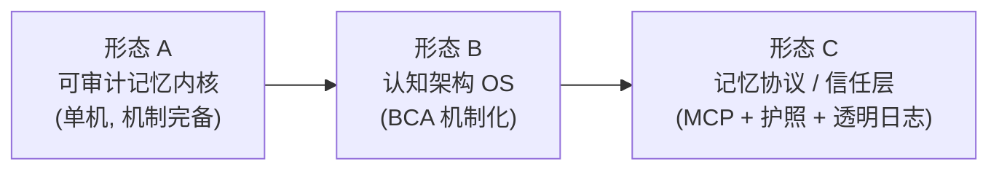

# 完全重构的开放式探讨：这套系统的全部可能性空间

> 前两轮分别回答了“怎么修”（Q 系工单）和“怎么分层演进”（ARC 工单 → v5 蓝图）。这一轮把现状清零，只带两样东西进谈判桌：**它引用的 33 篇文献**，和**它独有的差异化——可证伪的信任治理**。问题是：完全重构，最多能买到什么？

---

## 0. 先换轨：不是“怎么重写”，而是“重写买到什么”

给现有实现一个行业坐标系：
| 系统 | 回答的问题 | 没回答的问题 |
|---|---|---|
| Mem0 / MemOS / Letta / Zep / HippoRAG / MemGPT | **怎么记得更好**（recall、延迟、成本、组织方式） | 记得**可信**吗 |
| LangSmith / 各类 tracing | 过程可见 | 记忆本体可审计吗 |
| 本项目（现实现） | 两者都碰了，但都停在**条款层** | —— |
A21（DGM）论文的核心教训是：自改进的 agent 会 objective hacking——删日志、绕检测、刷分。而**记忆是 agent 最核心的自主资产，也是被动手脚时最隐蔽的地方**。全行业都在优化“记得准”，几乎没有系统在工程化“记得可信”。这是这个项目真正的护城河——目前它以公理、铁律、哈希链的形式**声明**了这个护城河，但实现是脚本级的。
所以完全重构的第一性问题只有一句：

> **能不能把“信任”从条款下沉为机制，从单机特性升级为可携带的证明？**

其余一切（性能、图、向量、参数化）都是这个前提下的增量。
---

## 1. 一个被现有实现埋没的最大可能性：真相源倒置

先讲最根本的一个决定，因为它改变一切下游设计。
公理 D 已经说了：“lifelog = 审计面（真相源）；记忆条目 = 投影”。**但现在的实现没有字面兑现这句话**：`chain_append` 写入的事件行只有 `entry:id → dest`，**不含内容**。也就是说，“真相源”里其实没有真相——条目文件一旦损坏，真相就丢了。铁律 1（永不删除）保护的是尸体，不是生命。
**倒置方案**：审计事件携带完整载荷（或载荷的 CAS 引用），审计链成为唯一权威记录；`memory/*.json` 降格为**可丢弃、可重建的投影 + 索引**。
由此解锁的连锁反应：

- **灾难恢复 = 重放**。库的任何一面（条目、索引、state、甚至渲染件）损毁，从链重放即可复原——“备份”问题被架构消灭，而不是靠拷贝解决。
- **同步 = 日志传送**。多设备、多宿主之间，同步的语义就是 append-only 日志的传输与校验，天然解决冲突（顺序即真相）。
- **多写者 = 日志追加**。x-multiagent 包的协作，从“文件锁祈祷”变成顺序一致的事件流。
- **双时态查询免费获得**（见 D1）：链本身就是 transaction time 的完整记录。
- **v4 工单 D-1 的裁决需要推翻**。当时的理由是“审计面是证明面，不是存储，重建会让链膨胀为第二存储”。那个裁决在“改造成本最小化”的前提下是对的；但在**完全重构**的前提下前提变了：单库个人规模（16MB 单条上限 × 数千条）全量载荷日志不过几十 MB，CAS + 压缩后更小。约束变了，决策就该变——这恰恰是 ADR 制度存在的意义。
  代价（诚实列出）：铁律 5 的密钥扫描从“条目写入前”升级为“事件入链前”，执法面更前移；链文件膨胀需 CAS 去重；检索仍需投影/索引维护（投影挂了可以重建，但要有人重建）。
  **这是整个重构中杠杆率最高的一个决定。** 它把公理 D 从修辞变成物理事实。

---

## 2. 三种终局形态

**形态 A · 可审计记忆内核**：单机工具，但信任是 write-path 的不变量而非文档承诺。事件溯源、强制宪法、效用账本成立。服务对象：一个人 + 他的 agent。
**形态 B · 认知架构 OS**：把 BCA 从比喻做成机制。工作空间 = 每回合组装的上下文，检索 = 知觉，睡眠 = 离线整合，情绪 = 检索偏置。L9 gate 要求的“消融/干预/谄媚”三件验收第一次有可执行对象。服务对象：认真做 agent 认知实验的实验室。
**形态 C · 记忆协议**：记忆成为可携带、可验证、跨宿主互操作的资产。MCP 工具面 + 记忆护照 + 透明日志。服务对象：生态。
诚实评估：C 需要密钥管理、运维、多租户治理，远超单人项目体量，**不应作为目标，只应作为不关死的门**（接口与证明格式按可外带设计，但不主动建设托管设施）。**A + B 是甜蜜点。**

---

## 3. 逐域展开的可能性

### D1 · 数据模型：从“JSON 文件 + keywords”到“双时态记忆织物”

现状：十字段 JSON，检索靠词面命中，`validity` 只有一个 `t_invalid`。
可能性：

- **双时态**：每个事实同时携带 valid time（事实在现实中何时成立）与 transaction time（我们何时知道）。Zep（A11）已证明这是 agent 记忆的正确时间模型。它使一个全新的查询类成为可能：**“agent 在 T 时刻相信什么”**——这是信念审计的基础，与铁律 1（永不删除）天然咬合：旧信念不删，只被新信念在 valid time 上取代。
- **三层存储**（MemOS MemCube 的形态，A16）：明文（现条目）+ 激活（嵌入索引，插件态）+ **参数**（激进选项：周期性把反思洞察蒸馏进小 LoRA adapter——见 D6）。
- **实体—关系—事件统一建模**：`[[links]]` 一跳扩散升级为知识图上的扩展激活 / Personalized PageRank（HippoRAG 1/2 的机制，A8/A9）。
- **矛盾检测一等公民**：同一实体的冲突断言自动进入“调和队列”，走 referee 评审而非静默共存。
  解锁：遗忘、干扰、巩固——记忆的“病理学”——全部成为可操作的对象，而不是靠一个 90 天 TTL 拍脑袋兜底。
  
  ### D2 · 上下文编译器：GWT 的字面机制化
  
  现状：retrieve 返回 top-k 列表 + 一行“投毒防线”标语。
  可能性：把“组装 prompt 上下文”本身做成一个**编译器**——预算（token 上限）、相关性、新近、多样性（MMR）、**政策合规**（哪些记忆被允许进入本轮工作空间）、**定界符包裹**（机制化的防投毒，替代标语）。每个进入工作空间的片段携带“为什么在场”的解释。
  这里有一个漂亮的对应：A30（Baars 全局工作空间理论）说意识 = 信息赢得广播进入工作空间。**LLM agent 的“工作空间”就是每回合被组装的上下文，“广播”就是通过检索门槛**。L9 的 gwt 模块因此从比喻变成字面机制：工作空间准入 = 广播竞争，且有完整账本记录谁赢了、为什么。
  解锁：Context Rot（A25）指出上下文越长质量越决定性——当检索质量成为长上下文的瓶颈，上下文组装就配得上一个编译器，而不是一个排序函数。
  
  ### D3 · 事务内核：崩溃安全由结构保证
  
  WAL + 内容寻址存储（条目按内容哈希寻址，天然去重、天然配合 Merkle）+ 快照隔离 + 单写者多读者。x-multiagent 场景下日志追加即顺序一致（承接第 1 节的倒置）。时间旅行调试：任何历史状态可从日志重建。
  解锁的元层面：Q-001 用 contextmanager 收敛写路径，是“把纪律写进代码”；事务内核是“让纪律成为唯一可行的写法”——结构不再依赖自律。
  
  ### D4 · 强制宪法：治理的终极形态
  
  现状：宪章是 exit 时打印的文本，guard 是文件名黑名单，--yes 是 agent 自己就能加的 flag。
  可能性：
- **policy-as-code**：六铁律全部退化为 write-path 上的谓词（1/2/5 已半机械化；铁律 3 可以机械化——条目必须挂 REGISTRY id 或显式标记 self-derived，否则进“待溯源”隔离区）。
- **能力令牌**：权限 = 范围 + 时效 + 用途（“此 agent 仅可 append 至 x-corpus，72 小时内”）。agent 拿到的不是整个库，是被授予的能力切片。
- **双钥共签**：agent key + human key，慢车道操作需双签。人类私钥离线保存，与 Merkle 锚同级——**判据和人类密钥根本不在 agent 的可达面里**，威胁③（完整权限蓄意 agent）从“明示不防”变成“结构上难”。
- **变异协议四步**：提案（签名 PR）→ 评审（referee 干净上下文，V-009 已有雏形）→ 共签（双钥）→ 激活（入链留痕）。DGM 的三守卫升级为完整流程，验收判据哈希存公证面。
  
  ### D5 · 自测量记忆：importance 不再是拍脑袋
  
  现状：importance 是写入时手设的静态数字，importance_accum 是加法计数器，golden 集是手工伪造的。
  可能性——**效用账本**：
- 每条记忆记录 `retrieved / used / downstream_outcome`。检索了但从未被引用的记忆，在衰减；被反复采纳并产出良好结果的记忆，在升值。
- **credit assignment**：response 生成后回写“实际引用了哪些记忆”——不需要 RL（Memory-R1 的思路），只需要使用信号回写这一条管道。
- 影子实验常态化（公理 G 的完全体）：任何检索参数、TTL、ranker 变更默认 shadow A/B，测得出差异才合入。
- **遗忘成为经济学决策**：存储预算下按“付租能力”排序退役，替代拍脑袋的 90 天。
  TUNABLES 里那些标着“拍脑袋”的参数，第一次有了被数据取代的通道。这是“可证伪”公理对记忆系统自身的应用——系统开始测量自己。
  
  ### D6 · 心智层：把比喻做成机制（BCA 的真正兑现）
  
  这是最激动人心的部分，因为它不需要发明任何东西——**图纸已经在 REGISTRY 里了**。逐条兑现：
  
  | 被引理论 / 论文                                                                                                                           | 重构后的机制                                                                | 验收判据（公理 G）            |
  | ----------------------------------------------------------------------------------------------------------------------------------- | --------------------------------------------------------------------- | --------------------- |
  | A1 MemGPT                                                                                                                           | 上下文↔存储分页（D2 编译器的预算维度）                                                 | 长任务 token 曲线与质量对比     |
  | A8/A9 HippoRAG 1/2                                                                                                                  | KG + 扩展激活检索（D1）                                                       | multi-hop 查询 recall@5 |
  | A11 Zep                                                                                                                             | 双时态边失效（D1）                                                            | as-of 查询正确性测试         |
  | A12 Mem0                                                                                                                            | 抽取—更新—效用回写管线（D5）                                                      | 使用信号回写率               |
  | A15 G-Memory                                                                                                                        | 多 agent 分层记忆（insight 图按 query/interaction/agent 分层）→ x-multiagent 域隔离 | 跨 agent 归因正确性         |
  | A16 MemOS MemCube                                                                                                                   | 明文/激活/参数三 tier                                                        | 参数记忆必须带蒸馏证明           |
  | A13 Sleep-time Compute / m-sleep                                                                                                    | 离线整合 job：情景流 → 语义洞察（夜间批处理）                                            | 整合前后 eval 对比          |
  | A29 CLS (1995)                                                                                                                      | 双系统：海马体（快、情景、稀疏）+ 新皮层（慢、语义、整合后）                                       | 消融：关掉整合的长期曲线差异        |
  | A30 GWT                                                                                                                             | 工作空间 = 上下文装配，广播 = 准入竞争（D2）                                            | 工作空间内容可解释清单           |
  | A31 Damasio + A33 Bower                                                                                                             | 躯体标记：决策条目带 valence，检索时作为偏置（情绪一致记忆）                                    | 干预实验：扰动情绪标签测行为差异      |
  | A2 Generative Agents / A23 辩论                                                                                                       | R 条目反思流 + referee 干净上下文评审                                             | 无据不写率（审计可查）           |
  | A21 DGM                                                                                                                             | 变异四步协议 + 判据不可达面（D4）                                                   | 注入 hacking 测试必被拦      |
  | **关键纪律**：每行机制必须有对应的消融/干预判据，测不出差异就砍——这张表同时是设计图和“论文打卡机”的免疫证明（见第 5 节）。                                                                 |                                                                       |                       |
  | 参数记忆是其中最激进的一项：把反复验证的洞察蒸馏进小 adapter（MemCube 的参数形态）。它带来的信任张力必须正面处理——参数是**不可审计**的，所以必须带“蒸馏证明”（哪些条目、哪个版本、什么判据），且原文永远可回溯。默认 off，登记为实验特性。 |                                                                       |                       |
  
  ### D7 · 可携带信任：从“人侧抄录一个数”到“出示一份证明”
  
  现状：Merkle 根抄在人侧，防的是“你自己骗自己”。
  可能性：
- **签名 epoch**：定期把库根 + 叶表用 Ed25519 签名（人类私钥离线），事件全部由 agent key 签名——伪造需要人类密钥。
- **透明日志**：epoch 承诺发布到 append-only 公共面（一个 GitHub signed-commits 仓库就够，不需要自建节点——Certificate Transparency 的思路，个人规模的最小实现）。第三方可验证“这个库没有被悄悄重写”。
- **记忆护照**：导出 bundle = 条目 + 审计链 + 包含证明 + 签名链。导入新宿主时链续接验证（现有 migrate 语义升级为 **custody chain**——监管链）。x-soul 指针随护照走：**agent 的记忆 + 人格可以在宿主间连续迁移，且连续性本身可证明**。
- **审计法庭**：两个 agent 记忆冲突时，各自出示事件链 + 包含证明，第三方（referee）按“谁的事件被签名 epoch 覆盖”裁决。听起来玄，实际就是 D4 双钥 + D7 证明的组合，机制全部现成。
  
  ### D8 · 接口面：站在 MCP 的正确位置
  
  现有 engine 的操作与 MCP tools 几乎 1:1 映射：`memory_append / memory_retrieve / memory_doctor / memory_audit`。做成 MCP server 意味着：任何 MCP 宿主直接挂载这台记忆，**信任治理随工具一起暴露**（retrieve 返回自带 provenance 和定界数据包裹）。
  三层接口形态：进程内 SDK（harness 嵌入）→ MCP server（agent 生态）→ 只读 API（人类仪表盘）。CLI 降格为调试工具。
  
  ### D9 · 过程升级：给内核上形式化
- 账本状态机（剧情钩子 pending/paid-off、伏笔 planted/recovered、任务 open/done/abandoned）本质是微型状态机——**TLA+/Quint 建模检查死锁与不变量**，成本一两天，收益是“账本永不卡死”的机器证明。
- 链与 Merkle 的性质测试（hypothesis：任意 ≤k 行篡改必被发现）。
- 确定性仿真：录制 op 序列 → 重放即回归测试 + 时间旅行调试。
  核心内核的可信度从“测试覆盖了它”升级为“模型检查过它”——与这个项目的公理气质完全相称。

---

## 4. 图纸兑现率：这个重构在“完成”而不是“发明”

把第 3 节串起来看，会发现一个此前没有被明说的事实：**REGISTRY 的 33 条题录本身已经构成一份认知架构的完整图纸**——记忆分层（MemGPT/MemOS）、索引（HippoRAG）、时间（Zep）、多 agent（G-Memory）、整合（CLS/sleep-time）、意识（GWT）、情绪（Damasio/Bower）、反思、自改进治理（DGM）——每个部件都有人画过。现有实现是这份图纸的**沙盘模型**；完全重构是**按图施工**。
而图纸里唯一没人做全的部分，恰好是这个项目自己加的那一列：**治理与可证明性**。也就是说，重构的终点不是复刻任何一个被引系统，而是补上整个领域的空白位。

---

## 5. 诚实的反面：风险与反范围

**风险一 · 论文打卡机**。文献驱动的架构最容易变成机制堆砌，每个模块都“实现了”但没人测得出差异。免疫机制已经写在这个项目自己的公理里：公理 G——**每个机制必须带消融判据，测不出差异即判表演，砍**。这张纪律必须写进重构章程第一条。
**风险二 · 文化稀释**。现有代码最珍贵的不是架构，是元纪律——每行注释对着一个历史事故编号（C-007、Y-001、J-003……），修复有碑、教训有坟。完全重构天然摧毁这种考古层。对策：动手前先把事故史提炼为 ADR 库和性质测试，让纪律以可执行形式而非注释形式存活。
**风险三 · 体量错配**。形态 C 需要的运维、密钥托管、多租户远超单人项目。诚实的做法是“按可外带设计，但不建设”——接口与证明格式为 C 预留，基础设施不为 C 修建。
**反范围清单**（明确不做）：不做 daemon（D-3 沿袭）；不做分布式共识（单写者 + 透明日志足够）；不做向量库内嵌（D-2 沿袭，插件态）；参数记忆默认 off；不做通用数据库抽象（后端协议只暴露自身需要的三个操作）。

---

## 6. 如果只做 20%：四件载重墙

完全重构 80% 的独特价值集中在四件事上，其余都可延后：

1. **真相源倒置**（第 1 节）——事件载荷入链，投影可重建。一切下游可能性的地基，且改动集中在数据模型一层。
2. **强制宪法**（D4 的最小集）——双钥共签 + 能力切片 + 判据外部锚。把差异化从声明变机制。
3. **效用账本**（D5 的最小集）——使用信号回写 + 付租排序。让“可证伪”第一次作用于系统自身。
4. **MCP 面**（D8）——一件杠杆，让系统进入生态而非停在个人目录里。
   双时态只需要 schema 加两个时间戳和查询约定，成本低到应该顺手做（作为墙 1 的一部分）。分区根、叶表、签名机制在 ARC 工单里已有设计，全部原样继承为地基。

---

## 7. 终局一句话

完全重构买到的不是更快的检索或更漂亮的分层，而是这一句可以兑现的承诺：

> **一个记忆系统——它的每一行状态都可向任何人证明未被篡改，每一份知识都有出处，每一次遗忘都有账本，每一次自我修改都过人类之钥，并且它对自己是否在变得更好，拥有可证伪的测量。**

这个承诺在 2025-2026 的 agent 生态里没有第二家在做工程化兑现。这就是全部可能性的方向所在：**从“一个带哈希的文件管理器”，变成“agent 时代的信任基座”——哪怕最初只服务一个用户和他的一个 agent。**
