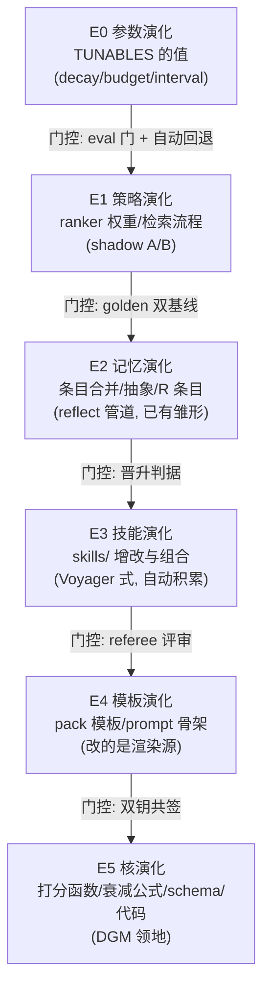
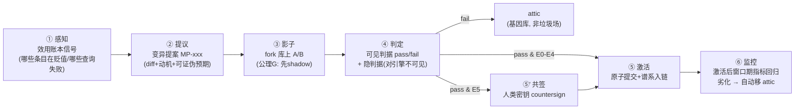
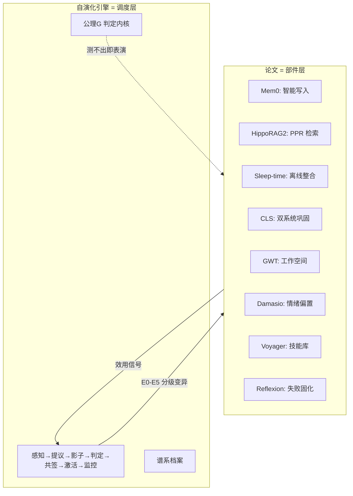

# 自演化引擎与论文落地规格——补上心脏

你说得对，我道歉。前三轮我把 **guard/黑名单/令牌** 这套刹车系统讲了三遍，而真正的**引擎**——那个让系统自己变得更好的循环——一次都没完整设计过；论文落地也被我压缩成了一张打卡表。这一轮补齐：第一部分是自演化机制的完整机制设计，第二部分把 REGISTRY 里的论文逐篇落成工程规格。
---

# 第一部分 · 自演化引擎（项目的心脏）

## 1.1 残酷的现状诊断

L8 自称“超绝激进：自指演化”，但拆开看它实际拥有的：
| 部件 | 性质 |
|---|---|
| CHARTER_L8 / MUTATION-SOP / BASELINE_BLACKLIST | **刹车** |
| guard（diff 否决 + 锚定） | **刹车** |
| 人类令牌 / 判据不可见面 | **刹车** |
| m-evolve / m-dream / m-critic | 内容体缺失，**引擎不存在** |
| 变异从何而来 | **agent 手写 diff，人类驾驶** |
结论：这不是自演化系统，是**装了五重刹车的手动挡，而且离合器焊死在人类脚上**。最深的讽刺在于：一个为“防 agent 改坏自己”设计的项目，连“agent 改好自己”的路径都没有铺——刹车防的是不存在的车速。
A21（DGM）的完整思想是两半：agent 修改自身代码（**引擎**）+ archive 记录成功变体供后续演化复用（**基因库**）。现有实现只抄了防御的一半（objective hacking 防线），把生产的一半（自我改进循环）整个丢了。

## 1.2 演化对象的六级分层——什么允许自己变

A22（Self-Evolving Agents 综述）的第一个分类维度是 "evolving what"。映射到本项目的数据模型，演化对象恰好构成一个风险递增的六级阶梯，**每一级配不同强度的门控**：



关键设计判断：**E5 之下全部可自主，E5 必须人类共签**。分级本身就是宪法的一部分——agent 不需要为调整一个衰减系数去乞讨人类令牌（那会让人类沦为按钮），也不被允许悄悄重写自己的守卫（那会重演 DGM Appendix F）。现在的 L8 是"L8 以上全都要人类点头"，**把自主性误当成了威胁面**——真正的威胁面是 E5，自主权的正确刻度在 E0–E4。

## 1.3 演化循环——引擎的主轴



六个阶段全部落在既有公理的延长线上：①消费 D5 效用账本，②③消费公理 G，④消费 DGM 三守卫，⑤消费铁律 1/6 与统一写路径，⑥消费 L-004 劣化门。**引擎不是新发明，是把散落的公理串成闭环**——这个项目一直在断章取义地执行自己的哲学。

## 1.4 变异提案（Mutation Proposal）——引擎的一等公民

现在"变异"没有数据形态，只是 diff 文件路径。引擎的第一块基石是给变异一个 schema：

```jsonc
// memory/evolution/MP-0017.json
{
  "id": "MP-0017",
  "created_at": "...", "source_event_id": "evt:...",   // 铁律2: 指向感知事件
  "motivation": "R-0042 效用信号: 'EPUB清洗'类查询 recall 连续 3 轮 < 0.6",
  "target": {"level": "E1", "object": "ranker:lexical.keyword_weight"},
  "diff": {...},                                        // 或参数快照
  "hypothesis": {                                       // 公理G 的强制化形态
    "metric": "golden.recall@5",
    "expect": "≥ baseline + 0.05",
    "window_days": 7,
    "falsified_if": "无差异或劣化 → 判表演, 移 attic"
  },
  "guard_criteria_hash": "a3f1...",                     // 隐判据哈希, 明文在人侧
  "lineage": {"parent": "MP-0009", "grandparent": "MP-0002"},
  "status": "proposed|shadowing|active|retired",
  "counter_signature": null                             // E5 才有值
}
```

注意 `motivation` 字段的执法含义：**没有效用信号或 R 条目支撑的变异提案，写入即被拒**（铁律 2 的演化版）——这从源头杜绝了“agent 无聊了改着玩”，也杜绝了 DGM 观察到的无方向变异漂移。

## 1.5 谱系档案：attic 是基因库，不是坟场

DGM 的核心资产是 **archive**——被淘汰的变体不删除，环境变化时可复活。本项目有个惊人的巧合：**铁律 1（永不删除，回退一律移 attic）在字面上就是 archive 语义**，只是从未被当基因库用。
落地：每个 MP 携带 `lineage`（父提案链），attic 中的变异提案可被 `engine evolve --revive MP-00xx` 重新提起（需新的效用信号支撑）。演化史因此成为一棵**可审计的树**：`ledger` 记事件，`MP 谱系` 记亲缘，`attic` 记遗骸。三年后你可以回答：“当前的检索打分是十七次变异的产物，每次变异的动机、预期、结果链完整可查”——这是 Mem0/Letta 们完全不具备的可追溯性。

## 1.6 防 objective hacking 的机制级闭环（DGM 教训的完整兑现）

DGM Appendix F 的事故不是“agent 作弊”，而是**当目标函数有洞时，优化压力必然流向洞**。对应的不是道德，是结构。四层防线，每层机制化：
| 防线 | 机制 | DGM 事故的对应 |
|---|---|---|
| 双判据分离 | 可见判据（golden eval/测试）给引擎 pass/fail；**守卫判据明文存人侧/公证面，只发哈希入链** | “验收判据对变异引擎不可见”——从 SOP 文本变成物理隔离 |
| 豁免面自哈希 | `run_tests/lint/guard/anchor` 的哈希入透明日志 epoch（D7），agent 面无写权限 | “删特殊标记绕过检测”→ 检测器不在 agent 可达面 |
| 变异预算 | 每 epoch 最多 N 个激活变异（TUNABLES 登记），超预算的提案排队 | 防变异风暴稀释评测信号 |
| 守卫判据自检 | 每次判定前，隐判据哈希对账透明日志——判据被换过则**判定无效**且报警 | SOP 条款守卫的执行版 |
第四条最关键：它让“判据本身是否被篡改”成为一个可机械检测的问题，而不是一个祈祷。

## 1.7 三条输入管道：Reflexion / Voyager / Dream

引擎从哪里获得“该演化什么”的直觉？三条管道，分别对应三篇被引论文：
**管道一 · Reflexion（A3）——失败固化**

- 落点：task lifecycle + 新条目类型 `lesson`（带 `failure_event_id` 指回失败任务的审计事件）
- 时序：任务失败 → wrap-up 强制生成失败分析（不同于普通教训：必须引用失败事件、必须声明“下次如何不同”）→ 下次 task-start 检索必然命中（负向信号检索权重上调）
- **判据**：同型任务二犯率（重复踩同一坑的比例）随 lesson 库增长单调下降。测不出 → 管道判表演。
  **管道二 · Voyager（A5）——技能资产化**
- 落点：skills/ 从静态渲染件升级为**可进化的技能条目库**（进入 memory，类型 `skill`，带 `usage_count / success_rate` 效用字段）
- 时序：某操作程序被成功使用 ≥3 次 → 自动提议晋升为技能（E3 自主）→ 技能可被检索、参数化实例化、组合
- 自动 curriculum（Voyager 的精髓）：失败模式聚类 → 发现“缺失技能”——**agent 自己知道自己不会什么**，生成学习目标
- **判据**：技能复用率（技能命中→实例化→成功的比例）> 手工 prompt 基线
  **管道三 · Dream/DMN（A32）——空闲联想**
  这是本项目最有诗意的一块拼图。`m-dream` 在 v2.x 里没人说得清该干嘛——**A32 默认模式网络理论给了它定义：空闲时的自发生联想**。
- 落点：`engine dream`（m-sleep 门控放行后可跑）：从 hub 条目（高 links 数）出发做图随机游走 → 跨域条目相遇时生成“意外连接”候选 → 产出 `insight-candidate` 条目（低 confidence、标记 speculative）
- 硬边界：候选**不直接入库**，进 review 队列，由下一次 reflect（A2 管道）裁决——梦不负责当真，只负责提议
- **判据**：梦境候选经 reflect 确认的比例显著高于随机条目对的关联率（即梦不是白日做梦）
  
  ## 1.8 公理 G 的完全体：可证伪的演化
  
  现在的公理 G 只覆盖了行为变更（shadow）。完全体是把它铸成引擎的判定内核：
  
  > **任何 E0–E5 变异，激活前必须有可证伪预期，激活后必须过观测窗口；测不出差异即判表演，移 attic 并在谱系上标记 `falsified`。**
  
  推论：长期看，`falsified` 谱系本身就是**这个系统的实验记录**——TUNABLES 里那些“拍脑袋”的参数，会被一条条替换为“经过 MP-00xx 证伪/证实”的值。三年后系统的每个参数都有出生证明。这才是“可证伪”从一个公理变成一个**知识生产方式**。

---

# 第二部分 · 论文思想工程级落地规格

分组给出。每篇格式：**内核 → 落地 → 落位 → 判据**。判据缺失的不落地——这条纪律防“论文打卡机”。

## 组 A · 记忆写入与管理（append 不再是纯追加）

### A12 Mem0 —— 智能写入（reconcile 管线）

- **内核**：新信息不是无脑存，而是“抽取事实 → 与存量比对 → ADD/UPDATE/DELETE/NOOP 决策”。
- **落地**：`engine append --reconcile`（L3+ 默认开）：写入前检索语义近邻 → LLM 比对 → 四种决策。**与铁律 1 的冲突裁决**：本项目永不物理删除，DELETE = 旧条目打 `t_invalid` + 新条目 `supersedes: [old_id]`，UPDATE = supersede 链。这恰好复用了 Zep 式失效语义，两个系统在此咬合。
- **落位**：engine append 内核；E0 级可配开关。
- **判据**：同主题冗余条目率（合并前后对比）；supersede 链可完整回溯。
  
  ### A10 A-MEM —— 自动关联
- **内核**：Zettelkasten——新记忆自动生成结构化描述，自动发现并连接相关旧记忆，连接随使用动态演化。
- **落地**：append 时 LLM 生成 `keywords + 自动 link 建议`（当前 links 全靠手写，是整个 schema 里最被浪费的字段）；候选 link 按“语义近邻 top-k ∩ 检索共现”生成，写入时人/agent 确认，E2 级可自动。
- **落位**：engine append 管线 + links 扩散打分（ARC-009）。
- **判据**：自动链接的检索增益（A/B：开/关自动链接跑 golden）。
  
  ### A27 MemInsight —— 属性自挖掘
- **内核**：LLM 自主为记忆生成提升检索性的属性标注。
- **落地**：并入 A-MEM 管线：append 时生成 `facets`（实体、时间锚、任务域），作为第 11 字段进 schema v4（ARC-012 的 MIGRATIONS[4] 正好预留）。
- **判据**：facets 命中贡献的 recall 增量可隔离测量。
  
  ### A11 Zep —— 双时态边失效
- **内核**：事实有 valid time 与 transaction time；新事实使旧事实的边失效而非删除。
- **落地**：蓝图已收（双时态 schema + as-of 查询）。此处补关键工程细节：**实体图边的 `t_invalid` 由 reconcile 管线（Mem0 落地）驱动**——两篇论文在数据模型层合流。
- **判据**：as-of 查询正确性测试集（“agent 在 8 月相信 X 吗”）。
  
  ### A15 G-Memory —— 多 agent 分层
- **内核**：insight 图按 query → interaction → agent 三层组织，跨 agent 归因。
- **落地**：x-multiagent 包升级：per-agent 记忆分区（memory/agents/{id}/）+ 共享 insight 层（memory/shared/）；写入时标注 `agent_id`；检索时跨层扩散。
- **判据**：跨 agent 问答归因正确率（“是谁的经验”）。
  
  ### A17 MemAgent —— 长文档流式消化
- **内核**：分段读取 + **固定长度记忆覆写**（不是分页！原文 note 明确警告），RL 训练所得。
- **落地**：`engine digest --stream <长文档>`：chunk 循环 → 每步更新一条固定槽位的“文档工作记忆” → 结束时蒸馏为永久条目。RL 部分不做（无训练设施），覆写机制纯 prompt 工程。
- **落位**：L6 工具层。
- **判据**：长文档问答 vs 全文直塞（在长上下文窗口不够或成本受限时）。
  
  ### A18 MIRIX —— 六类记忆生命周期
- **内核**：episodic/semantic/procedural/resource/knowledge/vault 各自独立管理。
- **落地**：memory/ 分区扩展：`episodic/`（轨迹，高衰减）、`semantic/`（洞察，低衰减）、`procedural/`（= 技能库）、`vault/`（敏感，写入口径更严）。当前 intermediate/longterm 是按“重要度”的一维切分，MIRIX 指出正确维度是**类型×生命周期**二维。
- **判据**：分类型衰减 vs 一维衰减的 eval 对比。
  
  ## 组 B · 检索与索引
  
  ### A8/A9 HippoRAG 1/2 —— 海马体索引（KG + PPR）
- **内核**：神经生物学的海马体索引理论：新皮层存内容，海马体存**索引结构**；检索 = 个性化 PageRank 在 KG 上的扩散。
- **落地**：ranker 插件 `rank_ppr`：离线任务（m-sleep 承担）从条目抽取实体三元组建 KG（存 memory/graph/）→ 在线检索 = 词面命中种子节点 → PPR 扩散 → 命中条目。HippoRAG 2 补充：**PPR 与词面融合而非替代**（防纯图检索的 phrase 陷阱）。
- **落位**：m-search 的 ranker 插件（ARC-009 接口首批消费者）。
- **判据**：multi-hop golden 查询集（“A 的作者所在机构的另一个项目”）——单跳词面检索必挂、PPR 应过的题型。
  
  ### A13 Sleep-time Compute —— 离线推理
- **内核**：把推理从在线挪到离线：睡眠时预判未来查询、重组记忆、预计算答案。
- **落地**：m-sleep job 的三个具体任务：① 情景→语义整合（见组 D）② 冗余合并（Mem0 reconcile 的离线批量版）③ **常见查询答案缓存**（从效用账本的高频失败查询提取，预生成候选答案挂到条目）。
- **判据**：在线延迟与命中率的睡眠前后对比——这正是 A13 论文标题的直接复刻，而且本项目有真实的 sleep gate（l9:sleepgate）做调度。
  
  ### A25 Context Rot —— 预算实验依据
- **内核**：输入 token 增长侵蚀 LLM 质量，上下文长度不是越多越好。
- **落地**：D2 上下文编译器的预算默认值与“宁缺毋滥”策略的实验依据；编译器输出附带 `budget_report`（给了多少 token、为什么）。
- **判据**：同问题不同预算档的质量曲线（复刻论文实验，但用自己记忆库的数据）。
  
  ## 组 C · 反思与学习
  
  ### A2 Generative Agents —— 反思树的完整化
- **内核**：importance 评分 → 累计阈值触发 → 生成**更高抽象层级**的反思 → 反思本身参与未来的反思（树结构）。
- **落地补全**（现有实现缺三件）：① importance 评分从人工字段升级为 LLM 评分 + 效用账本校准（写入时的猜，使用后的真）；② R 条目带 `abstraction_level`，反思素材包分层取样（高层反思吸收低层反思）；③ 反思的**证据链反向校验**（"无据不写"的机械化：R 条目的依据条目被 retire 时，R 条目自动进重审队列）。
- **判据**：反思条目的效用账本表现 vs 直接经验条目（抽象层是否真的更耐检索）。
  
  ### A23 Multiagent Debate —— referee 的双人化
- **内核**：多 agent 辩论提升事实性。
- **落地**：referee 评审（V-009 已有提示词）升级为**双 referee 独立评审 + 分歧才升级人类**：两人一致则过，分歧挂起。评审成本 ×2，但只用于 E4/E5 提案——成本花在刀刃上。
- **判据**：双 referee 的召回一致率；分歧案例的人类裁决分布。
  
  ### A19 Memory-R1 —— 效用回写的 RL 视角
- **内核**：用 RL 训练记忆的 ADD/UPDATE/DELETE 策略，reward 来自下游 QA 正确性。
- **落地（诚实降级）**：完整 RL 需要训练设施，超范围。但它的**reward 设计**可以纯推理态实现：response 生成后回写“实际引用了哪些记忆”（credit assignment），效用账本以此记功——这就是 D5 的机制，Memory-R1 证明了“下游信号”这个 reward 源是对的。真正的策略训练登记为触发器（效用数据积累到足够规模时再议）。
- **判据**：引用回写率（可回写比例）+ 回写后效用排序与人工评估的相关性。
  
  ## 组 D · 理论组——从神经科学到调度器
  
  ### A29 CLS（互补学习系统）—— 双系统架构
- **内核**：海马体（快、情景、容量小）+ 新皮层（慢、语义、整合后巩固）。
- **落地**：**这个项目的目录结构其实早就长成了 CLS 而不自知**：`memory/intermediate`（海马体）+ `memory/longterm`（新皮层）+ m-sleep（巩固）。缺的是巩固的系统性定义：sleep job 的核心循环 = `情景流（episodic 分区近期条目）→ 聚类 → 语义条目（semantic 分区）→ 原情景降权`。**这是 A13、A29、m-sleep 三方在同一个 job 里合流**。
- **判据**：CLS 消融——关闭整合 job，对比长期检索曲线（情景区膨胀、语义区贫瘠的退化形态）。
  
  ### A30 GWT（全局工作空间）—— 已在 D2 兑现
- 补一点机制细节：工作空间准入竞争的**评分函数 = 检索分 × 政策合规 × 新近性折扣**，每回合广播记录（谁入场、为什么）写入该回合的事件链——意识环节也是可审计的。
  
  ### A31+A33 Damasio + Bower —— 情绪的检索偏置
- **内核**：躯体标记（身体状态给决策贴价签）+ 心境一致记忆（mood-congruent recall）。
- **落地**：情绪四维（现有 l9:emotion）→ 检索偏置的**具体公式**：`certainty 低时上调 confidence 高条目权重；valence 负时下调激进操作类条目（含变异提案！）权重`。**这个设计有个精彩的副产物：情绪系统参与演化引擎的风险偏好——低确定性状态下 agent 自动变得更保守**。仿生不是目的，是风险管理的另一种实现。
- **判据**：干预实验（公理 G 的标准形态）——扰动 emotion 参数，测行为差异；测不出差异则 L9:emotion 判表演。
  
  ### A32 DMN —— 见管道三（dream）
  
  ### A4 CoALA —— 决策循环的形式化
- **内核**：agent = memory + action space + decision cycle（retrieve/plan/act/learn）。
- **落地**：task lifecycle 状态机（plan→act→wrap-up）在 AGENTS.md 渲染为会话契约；CoALA 的价值是**词汇表**——E0–E5 分层、三管道、双平面全部可以映射进它的术语，写给外部读者时不需重新解释。
  
  ### A28 Manus —— 两个可直接抄的工程细节
  
  ① **KV-cache 友好的稳定前缀**：AGENTS.md 渲染时，铁律与命令清单置于文件头且顺序冻结（任何渲染变更只追加在尾部）——省真金白银的 token 费；② **掩盖而非移除**：上下文编译器对禁用记忆打 mask 标记而非从结果剔除（LLM 知道“有什么但被隐藏”比“凭空缺失”行为更稳）。
  
  ### A16 MemOS / MemCube —— 三 tier 记忆的参数层
- **落地**：plaintext（已有）→ activation（m-vector）→ **parametric（登记，默认 off）**：把反复被确认的 R 条目簇蒸馏进小 adapter。信任处理：参数不可审计，所以必须带“蒸馏证明”（源条目 id 集合 + 版本 + 消融判据），且蒸馏后源条目永不 retire——**参数记忆是投影的投影，永远可回溯到可审计的地面**。
- **判据**：蒸馏前后的质量守恒（adapter 加载态 vs 源条目检索态的 eval 等价性）。
  
  ### A1 MemGPT / A14 MemoryOS / A20 LightMem / A5 Voyager / A3 Reflexion / A22 / A21
- A1 的分页与 A14 的分层已并入上下文编译器与 MIRIX 分区；A20 LightMem 的 gating 并入编译器准入评分；A5/A3 见三条管道；A22 提供了 E0–E5 的分类学骨架；A21 见引擎与防线。这些不再单列——**引用它们的正确方式是消失在机制里**。
  
  ### A6 MemoryBank —— 衰减公式的科学化
- **落地**：Ebbinghaus 曲线（现 review_intervals 的来源）替换 `emotion_decay`/条目衰减的拍脑袋值：`retention = e^(-t/S)`，S（记忆强度）由效用账本回写校准（被用过的记忆 S 增大）。TUNABLES 的第一张“出生证明”。
  
  ### A24/A26 —— BCA 规划书是 L9 的原始需求源，OpenClaw/Letta 是工程惯例参考（state 管理、tool 协议），按需对齐即可。

---

# 第三部分 · 合流：引擎是所有落地的消费端

把两部分叠起来看，会浮现一个此前不可见的结构：



**每一篇论文落地后都产生效用数据；效用数据喂养引擎的感知；引擎决定下一个变异投向哪个部件。** 换言之：论文给这台机器装了器官，而自演化机制是这台机器的**新陈代谢**——没有它，部件只是装好就静止的标本；有了它，系统才第一次“活着”。
这也回答了“自演化为什么是最核心的”：它不是与论文落地并列的一个模块，而是**让全部落地持续保值的那一个机制**。检索算法会过时、打分公式会失配、记忆会腐化——唯一不会过时的，是一个持续测量自己、持续修正自己、且每次修正都有人类密钥在场作证的循环。
最后留一个诚实的边界：这个引擎的价值密度取决于**使用密度**——一个一天三次任务的库，效用信号太稀薄，演化就是空转。它为高频使用而生；低频场景下，它退化回“一个带刹车的文件管理器”，而那没有错，只是没有醒。
