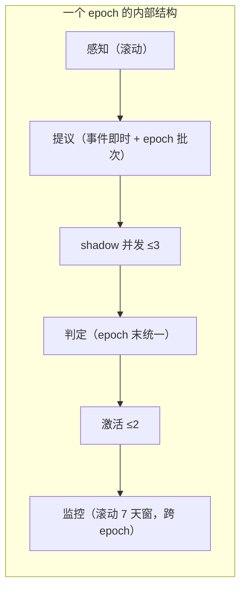

## 1.8 调度与节律——引擎的曲轴

1.3 把循环的六个阶段画成了图，但回避了一个问题：**循环什么时候转？** 没有调度器的引擎是一张 V8 图纸——缸体活塞都有了，没人知道点火顺序。
双触发器设计，快慢两条通道：
| 通道 | 触发源 | 延迟 | 产出 |
|---|---|---|---|
| **事件触发（快）** | D5 效用信号越阈（如某类查询 recall 连续 3 轮 < 0.6）、失败事件、漂移警报 | 1 小时内进入感知 | 单个 MP 提案，直接排入 shadow 队列 |
| **节律触发（慢）** | epoch 边界（TUNABLES.epoch_days，默认 7 天） | 每 epoch 一次 | 批次判定日：本 epoch 全部 shadowing 的 MP 集中判定、预算内激活 |



三条硬预算，全部登记在 TUNABLES（注意：**引擎自身的参数面属 E0，引擎可以自主调自己的油门，但不能调自己的判尺**——这是 1.10 的伏笔）：

- `shadow_concurrency_max = 3`——影子并发上限
- `activation_budget = 2`——每 epoch 激活上限，超出的 pass 排队顺延
- `target_cooldown = 1`——同一 target 两轮激活至少隔一个 epoch，防震荡（ranker 权重改上去又改回来的锯齿是演化系统最廉价的死法）
  顺带清算 m-* 命令。前三轮它们是四个空壳，现在每个都有了岗位：
  
  | 命令                                                                                            | 前三轮状态 | 引擎中的岗位                                                                    |
  | --------------------------------------------------------------------------------------------- | ----- | ------------------------------------------------------------------------- |
  | m-sleep                                                                                       | 无人说得清 | **维护窗调度器**：衰减、合并、attic 巡检、L-004 回归检查（Letta 的 sleep-time compute，见第二部分卡 1） |
  | m-evolve                                                                                      | 内容体缺失 | **提议面**：感知信号 → MP 草案，hypothesis 必填否则拒写                                    |
  | m-critic                                                                                      | 内容体缺失 | **判定面**：golden 跑分 + 判据哈希对账（1.6 第四条的执行者）                                   |
  | m-dream                                                                                       | 内容体缺失 | **空闲感知面**：1.7 管道三，无事件无提案的 epoch 才有资格跑                                     |
  | **判据**：调度成本 ≤ 每日 token 预算的 15%（TUNABLES），epoch 按时完成率 ≥ 90%。引擎不能把宿主吃穷——寄生型引擎会在第一轮预算评审里被人类拔掉电源。 |       |                                                                           |
  
  ## 1.9 判定面统计学——引擎最可能死于假阳性，不是失控
  
  科幻片里 AI 失控的方式是“变得太强”；工程现实里 AI 失控的方式是**把噪声当信号**。一次 shadow 偶然好 3 分 → 激活 → 系统为不存在的改进付出回归代价 → 下一次变异在已被污染的 baseline 上判定。**噪声污染是复利的。**
  四条统计纪律，全部写进 m-critic 的判定逻辑：
1. **最小样本量**：golden 集每指标 ≥ 30 条查询。样本不足 → shadow 期自动延长一个 epoch，而不是硬判。
2. **置信下界门槛**：激活条件不是 `mean_shadow > mean_baseline`，而是 `CI 下界 > baseline + δ`。δ 登记 TUNABLES。
3. **多重比较的预算替代**：M 个并发变异 × K 个指标 = 假阳性族膨胀。正经做法是 Bonferroni 校正，但本项目拒绝——用 1.8 的激活预算（≤2/epoch）从机制上限死族大小，复杂度预算优先。**能用刹车解决的统计问题，不要用数学解决。**
4. **漂移与变异效果解耦**：L-004 劣化警报触发时，先查同期其他激活变异——若 >1 个同时劣化，判**环境漂移**而非变异之过：冻结全部激活、重跑 baseline、漂移事件入 ledger。
   第 4 条藏着一个免费赠品：**漂移事件本身就是感知信号**——“环境变了”是变异最正当的动机之一。1.3 的感知阶段输入清单应加上它。
   **判据（红队自检）**：每季度人工注入 5 个已知劣化变异（复用 BASELINE_BLACKLIST 的构造方式，比如把 keyword_weight 乘 -1），引擎必须 100% 检出并移 attic。检出不了 = 判定面失明 = 整个引擎判表演。**一个不能识别坏变异的引擎，没有资格识别好变异。**
   
   ## 1.10 引擎自身的阶梯位置——自指的最终裁决
   
   L8 宪章自称“超绝激进：自指演化”。1.1 拆穿了它没有引擎；现在引擎有了，必须回答宪章真正棘手的那个问题：**引擎改引擎，允许吗？**
   塔斯基的教训翻译成工程语言：足够强的系统不能包含自身的真值判定。落到本系统：**判定核不能成为它自己判定的变异对象**——否则一次“通过”的自我修改可以永久调低判定标准。这不是 DGM Appendix F 的偶发事故，这是逻辑必然。
   切分方案，零新概念，直接复用 E 阶梯：
   
   | 引擎部件                                                                                                                                         | 阶层     | 门控                         |
   | -------------------------------------------------------------------------------------------------------------------------------------------- | ------ | -------------------------- |
   | 参数面（epoch_days / 预算数 / 冷却期 / δ / walk 深度）                                                                                                    | **E0** | 完全自主，eval + 自动回退           |
   | 判据面（golden 集本体 / CI 算法 / 判据哈希机制 / 红队测试 / MP schema 定义 / 调度器代码）                                                                               | **E5** | 双钥共签 + 豁免面自哈希（1.6 第二条天然覆盖） |
   | 所以对本项目而言，**真正的自指演化不是“一切皆可改”，而是精确地知道哪一层不可改**。L8 宣言只需改一个词就成立：把“自指”改成“自指但有固定点”。                                                                 |        |                            |
   | 为什么不做 DGM 式全量自改？DGM 的收益依赖数千次变异 × 近无限算力 × 深archive；本项目每次激活的验证窗口是 7 天，全量自改在统计上**来不及验证**。1.9 的纪律反向约束了 1.10 的野心——章节互相咬合，这是规格自洽的标志，也是前三轮从没出现过的东西。 |        |                            |
   
   ## 1.11 冷启动与点火判据——引擎什么时候算“活着”
   
   冷启动悖论：引擎第一天感知输入为零（无效用历史、无 lesson、无 R 条目），而引擎的合法性恰恰来自感知驱动（1.4 的 motivation 执法）。解法三步：
5. **回放模式**：ledger 里躺着全部历史查询与结果——**它就是现成的测试集**。前 3 个 epoch 的 shadow 判定用历史回放替代在线 A/B：离线、无风险、样本量充足。这个项目最有讽刺性的资产是：三年的审计强迫症，在引擎上线那天变成了燃料。
6. **E0 优先**：首批变异全部从 TUNABLES 值域挑——最便宜、自动回退、零共签成本。让引擎从拧螺丝开始学造车。
7. **红队 epoch**：点火前跑一次 1.9 注入测试，判定面验明正身。
   **点火判据（上线后 30 天，全部可机械检查）**：
   
   | #                                                           | 判据                              | 为什么是它  |
   | ----------------------------------------------------------- | ------------------------------- | ------ |
   | 1                                                           | ≥5 个自主激活变异（E0–E2 层）             | 引擎真的在转 |
   | 2                                                           | **≥1 个变异被 L-004 移 attic**       | 劣化检测活着 |
   | 3                                                           | 全部激活变异的 MP 谱系完整可溯               | 可审计性   |
   | 4                                                           | 人类干预 = 0（E5 提案除外）               | 自主性达标  |
   | 5                                                           | 二犯率 / 技能复用率 / dream 确认率三条曲线开始出数 | 三管道可测  |
   | 第 2 条值得加粗再说一遍：**一个从未回退过的演化系统，和一个从未踩过刹车的车，只能证明同一件事——它没被开过。** |                                 |        |

---

# 第二部分 · REGISTRY 逐篇落地（清偿引用债）

诊断先行：REGISTRY 在册 32 条，被真正转成机制的只有半个（guard 抄了 DGM 的防御半）。其余论文的状态是“名字出现在注释里”。**引用一篇论文而不落机制，等于开学术空头支票**——读者（包括三个月后的自己）读到引用时会假设该机制存在，然后在调试时发现不存在。
本轮清偿**引擎直接依赖的骨架批 8 篇**。统一规格模板，每张卡五字段，其中**拒绝面是强制项——没有拒绝面的落地是抄写，不是设计**：

> 内核 → 采纳面 → 拒绝面 → 工程规格 → 验收判据

### 卡 1 · Letta / MemGPT——操作系统的分页隐喻

- **内核**：上下文 = RAM，外部记忆 = 磁盘，agent 自行分页调度；Letta 后续提出 sleep-time compute（空闲时离线整理记忆）。
- **采纳面**：main/external 分层检索已有；**sleep-time compute 直接定义了 m-sleep**——1.8 表里 m-sleep 的职责清单（衰减、合并、巡检、L-004）就是它的时间窗化版本。
- **拒绝面**：MemGPT 让 LLM 用函数调用自觉换页——长会话中忘调 page-out 是可靠性灾难。本项目分页由**确定性调度器**执行（guard 的领地），LLM 只提议。
- **工程规格**：`m-sleep` 每日低峰窗（TUNABLES.sleep_window=30min），任务队列固定顺序：decay → merge → attic 巡检 → L-004 → reflect 队列清空。
- **验收判据**：m-sleep 之后的首轮检索命中率 ≥ 睡前。sleep-time compute 的核心收益主张，直接可测。
  
  ### 卡 2 · Mem0——巩固决策的极简主义
- **内核**：写入时四选一：ADD / UPDATE / DELETE / NOOP，由 LLM 判定新信息与既有记忆的关系。
- **采纳面**：写入管道的 consolidate 决策树；UPDATE → merge（带 merged_from[]），NOOP → 去重。
- **拒绝面**：**DELETE 与铁律 1 正面冲突**——重解释为 attic 降档：“删除即遗忘”改为“删除即降权”。另外 Mem0 巩固的是事实，不是经验：它没有 lesson、没有谱系，这正是本项目的差异化面而非采纳面。
- **工程规格**：`consolidate` 命令，每次决策（含选择理由）入 ledger。
- **验收判据**：人工抽 50 条 merge/attic 决策，准确率 ≥ 80%。
  
  ### 卡 3 · A2（Generative Agents）——反思的触发条件学
- **内核**：观察累积越阈（原论文约 100 条）触发 reflection，产出高阶推论。
- **采纳面**：R 条目的触发器与生成管道——reflect 的“何时反思”抄的是**触发条件学**，不是内容。
- **拒绝面**：原论文的 salience/recency/importance 三元打分抄思想不抄权重（那是客厅派对环境调的）；社会模拟层全部不要。
- **工程规格**：条目累计 `access_weight × recency > reflect_threshold`（E0 可调）→ 生成 R 条目，links 指向 ≥3 条源条目。R 条目兼任 dream 候选的裁决人（1.7 管道三的闭环）。
- **验收判据**：R 条目命中率 > 其源条目平均命中率。**抽象必须比原子更常被命中，否则是无效归纳**——一条没人检索的 R 条目是自恋，不是反思。
  
  ### 卡 4 · A3（Reflexion）——失败的言语强化学习
- **内核**：失败 → 文字反思 → 注入下次同型任务上下文，无参数更新的“RL”。
- **采纳面**：lesson 条目类型 + task-start 定向检索（1.7 管道一的完整规格来源）。
- **拒绝面**：原论文的教训只活在单 episode 上下文里——**本项目必须持久化**（不持久化的教训正是本项目要治的病）；原论文跑固定 benchmark，本项目环境非平稳 → lesson 必须可证伪、可退役（被证伪 → attic，谱系保留）。
- **工程规格**：wrap-up 失败分支强制产出 lesson `{failure_event_id, lesson_text, next_time_diff, status}`；同型任务判定 = embedding 邻域 + 任务类型标签；lesson 在失败邻域任务中检索权重 ×k（TUNABLES）。
- **验收判据**：二犯率随 lesson 库增长单调下降；lesson 命中的任务成功率显著高于未命中（用 shadow 机制跑这条 A/B）。
  
  ### 卡 5 · A5（Voyager）——技能的复利
- **内核**：可执行技能入库、embedding 检索、环境反馈驱动自动课程——**agent 自己知道自己不会什么**。
- **采纳面**：skill 条目（E3 层）+ 晋升门（成功 ≥3）+ 失败聚类 → 缺失技能提议（自动 curriculum）。
- **拒绝面**：Minecraft 反馈即时可验证，本项目反馈以天计 → 晋升判据必须窗口化；技能本体先落**参数化程序模板**（结构化文本），可执行代码技能划入 E5 共签域——Voyager 的威力一半在执行，砍掉执行是明确损失，记入债务而非假装无损。
- **工程规格**：skill `{procedure, param_schema, usage_count, success_rate}`；task-plan 阶段可引用技能链组合。
- **验收判据**：技能复用率 > 手工 prompt 基线（1.7 已定，此处继承）。
  
  ### 卡 6 · A22（Self-Evolving Agents 综述）——分类学即宪法
- **内核**：按 evolving what / 触发时机 / 评测方式三维组织全部自我改进系统。
- **采纳面**：本文档 1.2 的 E0–E5 阶梯就是 "evolving what" 的直接工程化；反馈来源三分类（环境/自评/人类）映射 D5 账本 / m-critic / 令牌。
- **拒绝面**：**综述不提供任何机制，只提供地图**——它不能贡献一行代码或一条判据，引用它只能是结构性的。警惕拿综述当设计的遮羞布。
- **工程规格**：无运行时组件；产出 = 维度对齐表，每格注明本项目对应物，或“不适用 + 理由”。
- **验收判据**：矩阵无空格——每一个 "evolving what" 格子要么有落点，要么有显式拒绝。
  
  ### 卡 7 · A21（DGM）——基因库与双判据
- **内核**：agent 改自身代码 + archive 保存全部变体供复活 + benchmark 分数导向。
- **采纳面**：archive = attic 谱系化（1.5）；双判据分离（1.6 第一条）；变异预算（1.6 第三条 + 1.8 调度）。
- **拒绝面**：DGM 允许重写包括评测代码在内的一切 → 本项目判据不可见面 + E5 双钥；DGM 无预算跑数千变异 → 本项目 1.9 统计纪律。**抄 A21 的一半（防御）不抄另一半（生产）是前三轮的病，这张卡两面都签收。**
- **工程规格**：MP schema + `engine revive` + 判据哈希对账（均已规格于 1.4–1.6）。
- **验收判据**：pass@10——每 10 个提案中产出 ≥1 个持续存活 30 天的激活变异（DGM 式指标的时间窗化改写）。
  
  ### 卡 8 · A32（DMN）——空闲的价值
- **内核**：大脑默认模式网络在无任务时做远距离联想；离线巩固与意外连接。
- **采纳面**：m-dream 的图随机游走 + insight-candidate 队列（1.7 管道三）。
- **拒绝面**：**这张卡的拒绝面要写最大号：神经科学证据不能为工程方案背书。** A32 在本项目的角色是“给 m-dream 一个可辩护的名字”，不是“给 m-dream 一个存在的理由”——理由只能来自判据。隐喻当机制，是这个领域最流行的学术诈骗。
- **工程规格**：`engine dream --hub-walk depth=3 restart_p=0.15`；产出 insight-candidate `{speculative: true}`，只进 review 队列，由 reflect 裁决。**梦不负责当真，只负责提议。**
- **验收判据**：dream 候选确认率显著高于随机条目对关联率。
  
  ### 追溯矩阵（本批清偿一览）
  
  | 论文    | 落点               | 验收判据       | 引擎依赖   |
  | ----- | ---------------- | ---------- | ------ |
  | Letta | m-sleep          | 睡后命中率      | 1.8 调度 |
  | Mem0  | consolidate      | 决策准确率      | 写入管道   |
  | A2    | R 条目             | R vs 原子命中率 | E2 层   |
  | A3    | lesson           | 二犯率        | 管道一    |
  | A5    | skill            | 复用率        | 管道二    |
  | A22   | E0–E5 表          | 矩阵无空格      | 元结构    |
  | A21   | MP / attic / 双判据 | pass@10    | 全循环    |
  | A32   | m-dream          | 确认率        | 管道三    |
  
  ### 债务余额与实施顺序
  
  REGISTRY 其余条目（HippoRAG / Zep / A-MEM 一类的检索架构批）本轮不清偿，且**故意不清偿**：它们服务于检索质量而非演化能力，不构成点火的阻塞依赖。更符合本项目哲学的排序方式是：**点火之后，让第一轮 D5 效用数据决定先还哪笔论文债**——让引擎自己排文献阅读顺序，这比任何人类拍脑袋的排期都更配得上“自演化”三个字。
  两个补录提名（登记 REGISTRY，v3.1 批次）：AlphaEvolve/OpenEvolve（搜索式代码演化，E5 共签流程的外部参照）；ExpeL（成功轨迹蒸馏，A3 的成功面姊妹篇）。
  **合流路线图**——第一部分与第二部分在此缝合成一条实施线：
  
  ```text
  M0  判据面先行：golden 集扩容 + 红队注入测试 + 判据哈希入链     ← 没有这步，后面全是裸奔
  M1  引擎骨架：MP schema + 双触发调度 + m-critic 判定面          ← 1.3–1.9
  M2  三管道：lesson(A3) / skill(A5) / dream(A32) + m-sleep(Letta) ← 1.7
  M3  回放模式冷启动 → E0 首批变异 → 30 天点火判据                ← 1.11
  ```
  
  M0 放第一位的理由无需解释：**前四轮的教训只有一个——先造刹车再谈车速；但这一轮补上的另一半同样成立：判据造好之后，必须有车从它下面开过去，否则它只是收费站。**
  刹车五重齐了，油门图纸齐了，点火程序齐了。下一轮只剩一个问题：谁去拧第一颗螺丝——以及拧的时候，MP-0001 的 motivation 字段里写什么。
