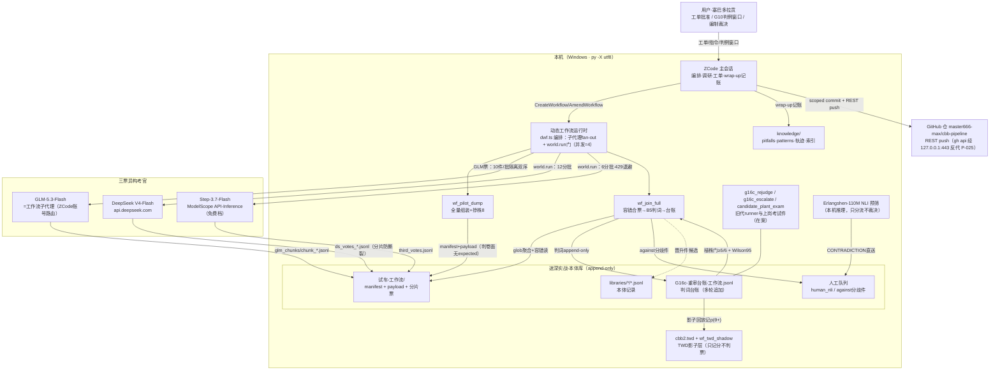

# 01 · 容器图——系统由哪几块组成、块与块怎么调

> 数据锚：考官编制=仪器变更登记 v1.x+2026-09-28 第三票上岗（G16c-重审台账-工作流.jsonl 编制3/3 轮）；工作流=dwfrun-e8af9c9b（.zcode/workflow-drafts/G16c-放量判卷*.dwf.ts）。

## 读图三问

1. **谁在花钱？** GLM 票走 ZCode 账号（子代理即通道）、DS 票走官方 API（全场最低价+缓存命中 ¥0.02/M）、Step 票走魔搭免费档（限速 ~15 RPM 是长尾）——百炼零消耗。
2. **谁是真源？** 台账 jsonl（append-only）是判词唯一真源；票文件（分片）是考官输出的唯一真源；合票器只读不唯一写。
3. **谁会拦住它？** 植株捕获门（≥5/6）不过=全卷降级仅参考；NLI 矛盾件与 against 分歧件不归概率管，直送人工。
