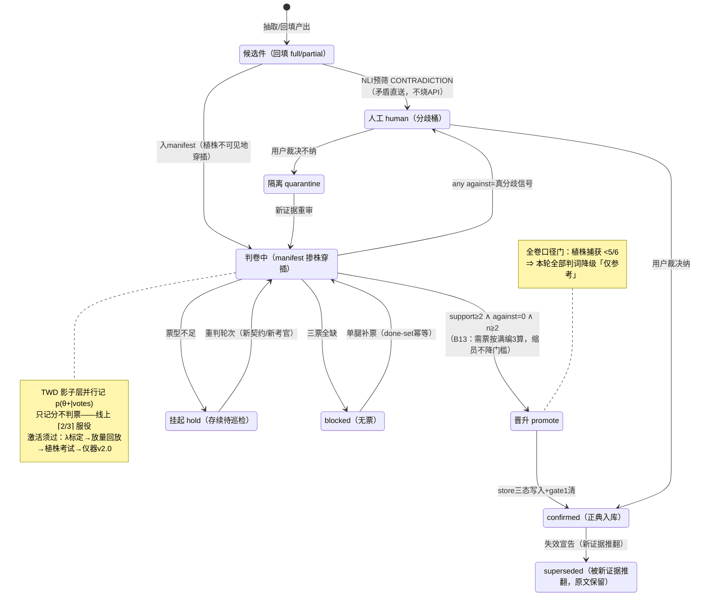

# 02 · 状态机——一件候选记录的判定生命周期

> 数据锚：B5 票门与 NLI 路由=g16c_rejudge.py / wf_join_full.py 现行实现；TWD 影子=补充工单-G5门三支决策优化-20260928.md；失效宣告=cbb2 矛盾分流/失效宣告件。store 三态写入=confirmed 不收错误、矛盾不静默合并。

## 读图两问

1. **哪条边最贵？** `人工 → confirmed/quarantine`——每件都花用户一次裁决；所以 against 硬门（行为纪律）高于任何概率后验，TWD 也不许越过它。
2. **哪个状态会静默腐烂？** hold——存量一大就成「看不见的库存」；治理靠 G17 巡检队列（幂等 rs.state）+ 重判轮次（新契约/新考官触发），而非原地等待。
