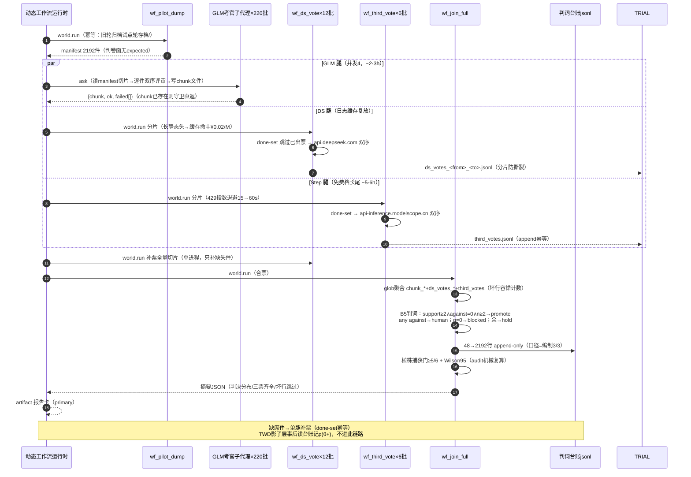

# 03 · 时序图——一件记录从组装到落台账的判卷链路

> 数据锚：dwf.ts 三相位编排（.zcode/workflow-drafts/G16c-放量判卷GLM会话端口DeepSeek官方API.dwf.ts）；幂等语义=wf_* 八件（done-set / chunk 守卫 / 分片文件）。

## 读图两问

1. **失败会卡死谁？** 谁都不会——三条腿各自幂等，单腿失败只产生缺席票（errors 列入台账），单腿补票找回，不重跑任何健康通道。
2. **什么是不可重放的真实花费？** GLM 子代理票（账号额度）与 DS/Step 的 API token；所以修订运行（AmendWorkflow）让已收线的 world.run 调用点走日志缓存复放，只有新调用点实跑。
