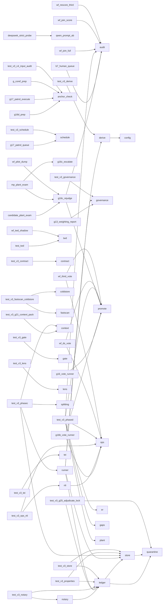

# 04 · 模块依赖图（自动生成，禁止手画）

> 生成器：`tools/gen_module_graph.py`（stdlib ast）· 范围=顶层 runner 29 件 + cbb2 模块 + tests · 重生成：`py -X utf8 tools/gen_module_graph.py`

## 读图提示

- 边=`import`（含 `from cbb2 import X`）；越靠近 cbb2 的节点越是被复用的地基（ops/promote/audit/twd）。
- 顶层 runner 之间**零横边**是纪律：runner 只准依赖 cbb2，不准互相 import（copy-paste 复用走模块化，不走 import 链）。
