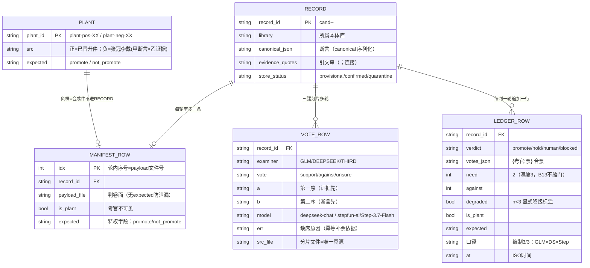

# 05 · ER 图——判卷账本的数据长什么样、怎么关联

> 数据锚：manifest/payload=wf_pilot_dump.py；票行=wf_ds_vote.py / wf_third_vote.py / glm chunk 文件；判词行=wf_join_full.py / g16c_rejudge.py。契约为 jsonl 行级，无数据库——本图是**逻辑 ER**。

## 读图两问

1. **为什么 VOTE_ROW 和 LEDGER_ROW 分开两个文件族？** 职责分离：票文件=考官输出唯一真源（append 幂等、可单腿补票）；台账=合票判词唯一真源（审计链）。合票器是两者间唯一的读→写桥。
2. **为什么负植株不在 RECORD 里？** 张冠李戴株是合成件（甲的断言×乙的证据），本库无此实体——它只活在 manifest/payload/台账里，`expected=not_promote` 是特权字段，判卷面永不携带（防植株泄漏）。
