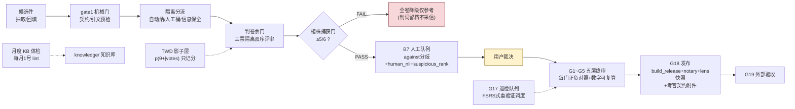

# 07 · 质量门流水线——从候选件到发布经过哪些关卡

> 数据锚：G1~G5 五层证据门=cbb-pipeline 审查与收口纪律；战役波次=G16（hold 处置）→放量→B7 队列→波 F（G18/G19）；G17 巡检与 TWD 影子为常设侧挂。

## 读图两问

1. **哪个门最会「假绿」？** 判卷票门——考官全灭/契约缺陷都能产出「格式正确的判词」，所以植株捕获门是它的**元门**：植株不过，判词再多也整体降级仅参考（B5 系两代实证）。
2. **人在哪几个点必须出现？** 黄色两处——用户裁决（against 分歧不归概率管）与终审宣判（执行无权自宣验收）。其余全部机械化。
